```{r setup, include=FALSE}
knitr::opts_chunk$set(echo = TRUE, message = FALSE, warning = FALSE)
```

# R para ánalisis de valores 
En este manual vamos a describir cómo sacar provecho del lenguaje R para aplicaciones de bolsa, análisis de carteras y valores. Expondremos conceptos y muchos ejemplos prácticos de aplicaciones de R en el área financiera y de bolsa de valores.

No se trata de un manual de R, por lo que para aprender los usos básicos del lenguaje, e iniciarse es mejor acudir antes a manuales como el [https://drive.google.com/open?id=1EoLm-rqr5eikmpodb90uIGyju6E1jBjZ](Manual de R para Científicos de datos).

R es un lenguaje muy completo gracias a que miles de colaboradores realizan programaciones intensivas de algoritmos de temas concretos y específicos y las ponen a disposición de la gente como paquetes libres. Estas librerías añaden funcionalidades a R, incrementan la utilidad del lenguaje y expandan su uso a áreas especificas.

En este manual describiremos los principales paquetes para trabajo con datos de bolsa y financieros, algunos son extremadamente potentes y no tienen nada que envidiar a aplicaciones específicas y de pago. La diferencia quizás, es el aspecto exterior o de uso, pero el nucleo al que se tiene acceso de manera gratuita y desinteresada con R, es gigante.

Los amantes de la Bolsa tienen a su disposicion miles de aplicaiones informáticas de análisis, gestión de carteras, representación de gráficos complejos, con estudios, indicadores y sistemas de inversión, entonces... ¿qué puede aportar R?, bueno, la respuesta para mi es sencilla, R aporta todo lo que tienen esas aplicaciones y **mucho más**, porque lo fundamental de R, es que no tiene límites, no estás limitado por los indicadores del programa, los sistemas, las estrategias preconcevidas que han programado otros para tí.... con R lo puedes hacer tú y lo mejor, es que puedes hacer cosas diferentes y de las que carecen el resto de aplicaciones normales para el gran público.

La desventaja es que requiere un aprendizaje y una familiarización con el programa y su lenguaje, con las librerías y paquetes específicos... eso es lo que intentaremos facilitar con este libro, cuanto más se dominine más amplias son las opciones.

Con R puedes aplicar técnicas no convencionales, sistemas diferentes que no podrías desarrollar con las aplicaciones (algunas maravillosas y estupendas) comerciales. Además tienes a tu disposición un trasfondo de funciones enorme de base matemática y científica que puedes aplicar a los datos, con tratamientos estadísticos complejos y gráficos personalizados, a demanada, que no podrás conseguir de otra forma.

## Estructura del manual

Hemos dividido el documento en dos partes principales, la primera parte continene la descripción de las principales librerías para uso con datos de bolsa y finanzas. Conocer estas librerías nos dará la base de  conocimiento sobre el que desarrollar los análisis personalizados. Desarrollaremos un capítulo por cada librería importante.

La segunda parte del libro será exclusivamente de casos prácticos, en los que veremos la aplicación real de R en análisis, estudios, sistemas de inversión, de menos a más complejidad con lo que tendremos una visión completa de sus posibilidades y nos servirán de base para despues, desarrollar nuestros propios sistemas. 

Las librerías que forman la caja de herramientas básica para análisis de valores son:

 * `quantmod` para obtener datos financieros desde la web, gráficas y mucho más.
 * `TTR`, que continene muchos indicadores clásicos.
 * [quantstrat](https://www.rdocumentation.org/packages/quantstrat/versions/0.8.2) que continene una completa base de funciones para programar sistemas de inversión
 * tratamiento de series temporales con librearias `zoo`, `ts` ..
 * `coinmarketcapr` librería para obtener datos y cotizaciones de criptomonedas, bitcoin etc.

Dedicaremos un capítulo a cada una de los paquetes o conjuntos de paquetes enumerados, con ejemplos básicos de las funciones más importantes. `quantstrat`,es sin duda la librería más compleja y completa, con ella tendremos una solida base de análisis, pero muchas veces en los datos o valores que queremos estudiar no buscamos un análisis profundo ni complejo, sino la vision de datos o representaciones rápidas, para lo que los otros paquetes son perfectamente válidos y más sencillos de comprender y usar. 


# LIBRERÍA `quantmod`
`quandtmod` es una librería fundamental para los que nos gusta la inversión, pues contiene funciones básicas para el trazado y para *descarga de datos* financieros de la web. 

Una de las cosas que más me gusta del mundo de la inversión en Bolsa de valores es la facilidad para la obtención de datos, algo que no es fácil en el resto de ramas de cualquier ciencia. En las cuestiones económicas, por tradición de análisis técnico, se han puesto a disposición pública multitud de datos y series temporales que proporcionan un delicioso comienzo a los amantes de las gráficas de datos. `quandmod` nos facilita la obtencion de estos datos y su representación.

## Obtener datos de internet

Para obtener datos de un valor `quantmod` nos proporciona una función versatil que los descarga de servicios web, se trata de: `getSymbols()`. Esta función permite descargar datos, series temporales de valores de multiples webs como *google* o *yahoo*.

Por defecto el comando `getSymbols()` devuelve un objeto **con el mismo nombre** que el símbolo (ticker) que se solicita, por lo que _no hace falta asignarlo a una variable_, pero si se desea almacenar los resultados en una variable concreta tenemos que establecer la propiedad `auto.assign=FALSE` al hacer la llamada de la función.

Veamos un ejemplo que obtiene los datos del índice *ibex35* desde la web de *yahoo* y luego pinta los datos (el ticker del IBEX35 en la web de yahoo es ^IBEX).

```{r}
    # instalamos quantmod si no está
    #install.packages("quantmod")    
    # lectura de datos financieros con quantmod
    library(quantmod) # cargamos el paquete
    
    # leemos los datos del IBEX
    getSymbols("^IBEX", # simbolo del Ibex en yahoo finance
               from = "2015-01-01", # desde fecha
               to = "2017-12-31",   # hasta fecha
               src = "yahoo",       # origen de los datos
               warning= "FALSE",
               adjust = TRUE)       # indicamos que nos devuelva los cierres ajustados por splits, dividendos  etc..
    
    # vemos el encabezado de los datos descargados
    # nótese que la variable se ha creado con el nombre de la llamada
    head(IBEX)
    
    
    # pintamos el valor de cierre Cl()
    png("imag/graf_ibex.png")
    plot(Cl(IBEX))
    dev.off()
    # pintamos el histograma de frecuencias de los valores máximos Hi()
    png("imag/histograma_ibex.png")
    hist(Hi(IBEX))
    dev.off()
```


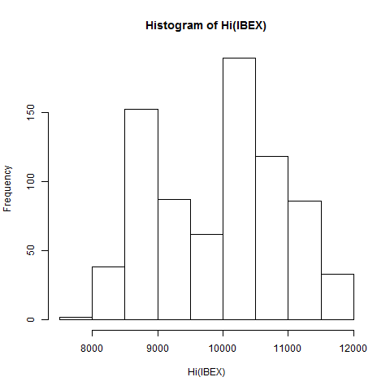

En el siguiente ejemplo asignamos los datos descargados directamente a una variable en R. Usaremos como origen el FRED (St. Louis Federal Reserve Bank's):

```{r}
    require(quantmod) # cargamos el paquete
    # asignar el valor a una variable
    # descargamos la serie de datos GDPPOT de la FRED y la asignamos a la variable valor1
    # GDPPOT= Real Potential Gross Domestic Product
    # DFF= Effective Federal Funds Rate
    valor1<-getSymbols("GDPPOT", from ="2010-01-01", to ="2015-12-31", src ="FRED", warning= "FALSE",adjust = TRUE,auto.assign=FALSE)
    png("imag/GDPPOT_FRED.png")
    plot.zoo(valor1)
    dev.off()
    # como veras en el caso de los datos FRED las fechas de inicio y fin las ignora, por lo que conviene probar siempre los datos
```


## Funciones de transformación `OHLC`
Si nos fiajamos en los datos leídos por la función `getSymbols()` observamos que R almacena los valores como clase `xts` y `zoo`que son clases tipo serie temporal.

La mayoría de los valores que lee `getSymbols()` contienen varias columnas de datos para cada fecha, este es el formato habitual de datos bursatiles en los que se almacena la: apertura (Op), cierre (Cl), máximo (Hi), mínimo (Lo), volumen y cierre ajustado. 

Por lo tanto las series temprales descargadas contienen (habitualmente) 6 datos para cada fecha concreta. Si queremos pintar la evolución del valor, debemos elegir qué columna pintar de esos 6 datos, o qué tipo de gráfica (pues las graficas de velas por ejemplo necesitan varios valores por fecha), esto lo hacemos con las funciones **OHLC** que sirven para especificar qué valor concreto queremos.

Las funciones denominadas **OHLC** se llana así por referencia a sus nombres en inglés (Open, High, Low, Close) hacen de filtro de los datos. Por ejemplo, Si nos hemos descargado el valor en serie temporal de la acion de x=telefónica, las opciones de filtro OHLC de los datos son:

 - `Op(x)` $\rightarrow$ serie temporal con solo los valores de apertura 
 - `Hi(x)` $\rightarrow$ serie temporal con los valores máximos  
 - `Lo(x)` $\rightarrow$ serie temporal con los valores mínimos 
 - `Cl(x)` $\rightarrow$ serie temporal con los valores de cierre 
 - `Vo(x)` $\rightarrow$ ..volumen 
 - `Ad(x)` $\rightarrow$ ..cierre ajustado 
 - `seriesHi(x)`$\rightarrow$ máximo de la serie completa
 - `seriesLo(x)`$\rightarrow$ mínimo de la serie completa
 - `OpCl(x)`, `ClCl(x)`, `HiCl(x)`, `LoCl(x)`, `LoHi(x)`, `OpHi(x)`,`OpLo(x)`,`OpOp(x)`,`HLC(x)`,`OHLC(x)`,`OHLCV(x)` este tipo de series calcula la diferencia de un periodo entre los valores indicados: Ejm de cierre a cierre ClCl, de Maximo a Cierre HiCl.

Como vemos los datos usados en series de valores de bolsa son especiales, son series temporales de varias columnas de datos y se pueden filtrar ordenar y extraer independientemente. También existen otras muchas funciones relacionadas con este tipo de series temporales  que permiten obtener qué clase es o saber qué columnas continene, como las siguientes:

```{r warning=FALSE}
    # Observamos los datos y funciones sobre los mismos
    head(IBEX)
    IBEX<-na.omit(IBEX)
    class(IBEX) # Mostrar la clase de los datos
    is.OHLC(IBEX)# Muestra si son o no datos del tipo apertura,máximo,mínimo,cierre.
    has.Vo(IBEX)# es TRUE si los datos contienen el volumen
    seriesHi(Cl(IBEX)) # nos devuelve el valor máximo de la serie
    seriesLo(IBEX) # el minimo de la serie de minimos
    
    # nos da una serie de valores logicos si la serie se acelera o no
    head(seriesAccel(Cl(IBEX)))
    
    # nos da una serie de valores logicos si la serie se ha incrementado o no
    head(seriesIncr(Cl(IBEX), thresh=0, diff.=1L))
    
```
## Funciones de retornos
Otro tipo de funciones son las que nos dan los retornos (diarios, semanales, mensuales, anuales) de la serie. El retorno es el porcentaje de incremento de valor en el tiempo, es una manera de normalizar las series temporales e independizarlas del precio actual atendiendo exclusivamente a su diferencia. 

Estas funciones de retorno incluídas en el paquete `quandmod` se usan así:

```{r}
    # Filtros de seleccion :: doble punto indica filtro de fechas
         head(IBEX['2017-12::']) # Datos del 2017/dic en adelante
    
    # Funciones de retornos
    # Se añade la función head para mostrar solo los primeros datos de cada tabla
        head(dailyReturn(IBEX)) # retorno diario 
        head(weeklyReturn(IBEX)) # retorno semanal
    
        monthlyReturn(IBEX['2016-12::']) # retorno mensual
    #quarterlyReturn(IBEX) # retorno por cuatrimestres
        yearlyReturn(IBEX) # retorno anual
    # allReturns(IBEX) # todos los retornos en una dataframe
    
    # pintamos la grafica de retornos semanales del IBEX       
    #png("imag/retornos_semanales_IBEX.png", height=300,width=600, units="px")
        plot.zoo(weeklyReturn(IBEX))
    #dev.off()
    
```
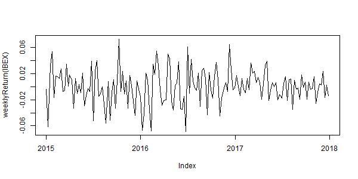

## Gráficas con `quandmod`
La librería `quandmod` tiene funiones interesantes para la representacion de gráficas de valores. En los ejemplos anteriores hemos usado las opciones de trazado de R base o de la librería `zoo` de series temporales (`plot.zoo`). Con `zoo` se simplifican los ejes y tramas para una mejor visualización de los datos que con la función de R base (`plot`).

```{r comparar graficas plot}
    # Comparacion de sistemas graficos
    png("imag/compara_trazados.png", height=400,width=600, units="px")
    par(mfrow=c(1,2))
    # pintamos la grafica con sistema R base
    plot(monthlyReturn(IBEX))
    # pintamos la grafica con zoo
    plot.zoo(monthlyReturn(IBEX))

    dev.off()
```

Para representar las series temporales de valores que, como hemos visto, contienen varias columnas de datos por cada fecha, existen tipos de gráficos especiales. Estos gráficos son usados en análisis técnico bursatil. Los dos formatos más habituales son: 

    * graficos de barras
    * graficos de velas japonesas
    * otros como los graficos de punto y figura etc. 


La aportación de estos tipos de gráficos es que representan de forma clara todos los datos disponibles en una misma representación que aporta información interesante de tendencias, volatilidad y rango etc.
Existen multtud de variantes de este tipo de representación, así como diferentes gamas de colores indicativos. Lo habitual es usar el rojo para las bajadas y el verde para las subidas. La librería `quandmond` contiene varias funciones específicas para representarlas que son `chartSeries()` y `barChart()`

### `chartSeries` y `barChart`
La función `chartSeries()` sirve para pintar la típica grafica de velas de valores, incluyendo todas las columnas de datos almacenados en la serie *OHLC*. Además permite añadir indicadores y volumen, así como plantillas predeterminadas de acabados y colores.

La funcion `barChart` es igual a `chartSeries`,excepto que en lugar de velas usa el tipo barra. 

```{r}
    # Usamos el motor gráfico de quantmod
    # sobre la serie de datos desargada del IBEX35
    chartSeries(IBEX['2017-12::'], TA=NULL,theme=chartTheme('white'))

    barChart(IBEX['2017-12::'],TA=NULL,theme=chartTheme('white'))
    
    # Añadimos indicadores a la gráfica    
    chartSeries(IBEX,TA=c(addVo(),addBBands()),theme=chartTheme('white'))

```
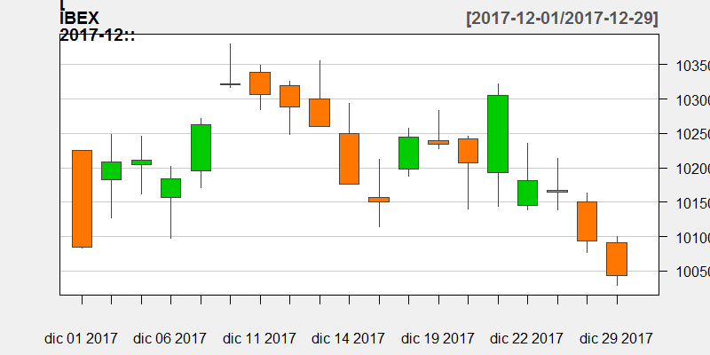

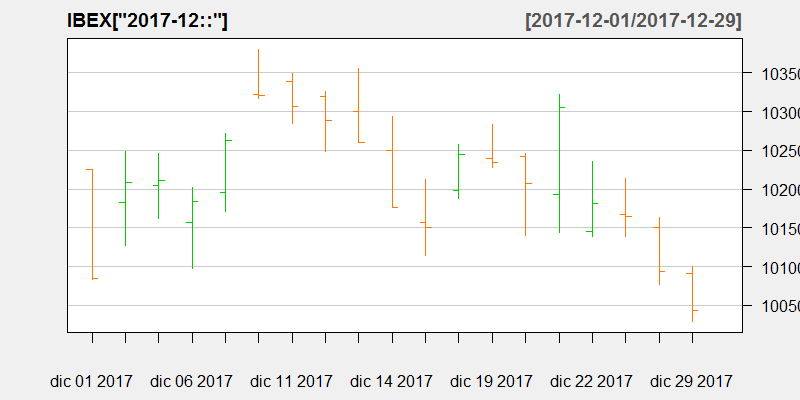

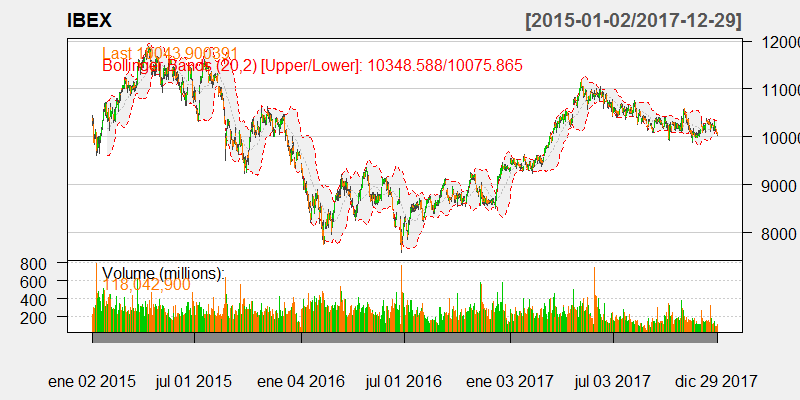

El argumento `TA=` permite introducir **indicadores** en la gráfica como el volumen o bandas de bollinger. El argumento `theme` indica el formato de trazado general del gráfico que puede personalizarse al completo (ejem: `chartTheme('white',up.col='blue',dn.col='red')` indicando que los colores cambien a azul y rojo).

Los indicadores que se pueden añadir al gráfico son:

 - `addvo()`: $\rightarrow$ añade el volumen
 - `addBBands()`: $\rightarrow$ Añade las bandas de Bollinger
 - `addMACD()`: $\rightarrow$ indicador MAC de convergencia de medias móviles
 - `addCCI()`: $\rightarrow$ añade el indicador *Commodity channel index*
 - `addADX()`: $\rightarrow$ añade el *Directional Movement Indicator*
 - `addCMF()`: $\rightarrow$ añade el *Chaiken Money Flow*
 - `addDEMA()`: $\rightarrow$ añade el *Double Exponential Moving Average*
 - `addDPO()`: $\rightarrow$ añade el *Detrended Price Oscillator*
 - `addEMA()`: $\rightarrow$ añade el *Exponential Moving Average*
 - `addEnvelope()`: $\rightarrow$ añade el *Add Price Envelope*
 - `addEVWMA()`: $\rightarrow$ añade el *Add Exponential Volume Weigthed Moving Average*
 - `addMACD()`: $\rightarrow$ añade el *Add Moving Average Convergence Divergence*
 - `addMomentum()`: $\rightarrow$ añade el *Add Momentum*
 - `addROC()`: $\rightarrow$ añade el *Add Rate of Change*
 - `addRSI()`: $\rightarrow$ añade el *Relative Strength Indicator*
 - `addSAR()`: $\rightarrow$ añade el *Parabolic Stop and Reverse*
 - `addSMA()`: $\rightarrow$ añade el **Simple Moving Average*, medias móviles
 - `addSMI()`: $\rightarrow$ añade el *Stocastic Momentum Index*
 - `addTRIX()`: $\rightarrow$ añade el *Triple Smoothed Exponential Oscillator*
 - `addWMA()`: $\rightarrow$ añade el *Add Weighted Moving Average*.

## Leer una lista de tickers como data.frame
```{r}
tt<-list()
symbol_list<-list("SAN.MC","TEF.MC")
f_ini<-"2008-01-01"
f_fin<-"2015-01-01"

#leemos cada ticker y los almacenamos en una lista
for(i in symbol_list){
    a= getSymbols(i, src = "yahoo", from = f_ini, to = f_fin,env=NULL,adjust = TRUE,auto.assign = FALSE)
    
    tt[[i]]<-a
}

datos<-data.frame(tt[[1]]$SAN.MC.Close,tt[[2]]$TEF.MC.Close)
autoplot.zoo(datos)
```

# LIBRERÍA `TTR`
El paquete `TTR`contiene muchos de los **indicadores clásicos de análisis técnico** así como funciones de descarga de datos de *Yahoo Finance* y otras funciones interesantes.

Entre los indicadores tienen programados muchos tipos de medias móviles (SMA, EMA, ALMA...ADX, RSI,) ampliamente usados en análisis.

Tiene una funcion de descarga de datos similar a `quantmod::getSymbols()` para yahoo denominada `getYahooData()`  y otra que descarga todos los ticker disponibles `stockSymbols()`, pero hay que tener en cuenta que solo funciona para el mercado americano AMEX NASDAQ y NYSE.

```{r "Ejemplo con TTR"}
    # Ejemplo paquete TTR
    library("TTR")
    # Obtener datos cotizados de yahoo
        # bajamos los datos de accion santander del 2017
        acc1 <- getYahooData("TEF.MC", 20170101, 20171231, freq = "daily", type = "price",  adjust = TRUE, quiet = FALSE)
        head(san)# vemoslos datos descargados (ojo porque hay dos cierres el ajustado y el real) por esto se recomienda usar mejor getSymbols de quantmod
    # La funcion getYahooData funciona pero se recomienda usr mejor getSymbols
        acc1<-getSymbols("TEF.MC", from ="2012-01-01", to ="2015-12-31", src ="yahoo", warning= "FALSE",adjust = TRUE,auto.assign=FALSE)
        
    # Calcular indicadores de medias móviles sobre los datos
        sma.50 <- SMA(Cl(acc1), n = 50) # media movil de 50 periodos sobre el cierre
        ema.20<- EMA(Hi(acc1),n=100) # media movil exponencial de 100 periodos sobre la maximos
        
    # trazamos un gráfico
        png("imag/ohlcsan.png", height=400,width=600, units="px")
        #acc1$SMA50<-sma.50
        #plot.zoo(acc1[,c(1,7)],plot.type="single", type="l", lwd=1.5) 
        plot(Cl(acc1))
    # y añadimos a la grafica de la media movil
        lines(sma.50, col="red", lwd=2)
        lines(ema.20, col="blue", lwd=2)
        dev.off()

    # Obtener todos los ticker del NYSE
    # nos devuelve todos los tickers del mercado NYSE
        nyse.valores <- stockSymbols("NYSE") # ojo solo funciona para AMEX NASDAQ y NYSE
        #head(nyse.valores)
        # guardar tabla como imagen 
            library(gridExtra)
            png("imag/tablanyse.png", height = 50*nrow(head(nyse.valores)), width = 200*ncol(head(nyse.valores)))
            grid.table(head(nyse.valores))
        dev.off()
        

```

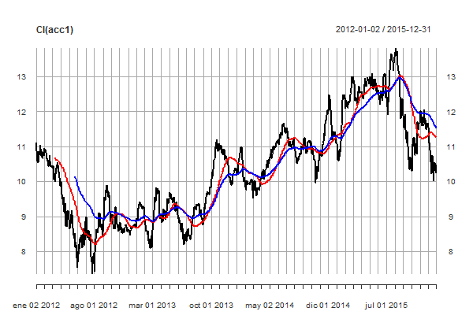


## Uso de indicadores
El paquete `TTR`tiene su principal aportación en la gran cantidad de indicadores que tiene, y la posibilidad de personalizarlos. Además las funciones internas manejan cualquier tipo de serie temporal de origen como *zoo, xts, timeSeries, ts, its, data.frame, matrix*... 

No vamos a realizar la descripcion de los indicadores, pero todos los clásicos están incluidos, y puede verse la descripción de cada uno en la propia documentación de la librería (Ejmpl: `?ZigZag`).

En cada caso se necesitará un tipo de entrada de serie temporal, según cómo se realice el cálculo de cada indicador, algunos solo necesitan los datos de cierre, y otros los datos OHLC al completo. 

```{r}
        acc1<-getSymbols("SPY", from ="2015-01-01", auto.assign=FALSE)
        
        precio<-Cl(acc1)
        rsi<- RSI(precio, n=14)
        # personalizamos la formula de RSI para que el volumen cuente en la masa de calculo
        rsi_1<-RSI(precio, n=14,maType="WMA", wts=volume)
        # personalizamos el RSI de forma que las subidas cuenten diferente y sobre distinto intervalo que las bajadas
        rsi_2 <- RSI( precio, 
                maType=list(
                    maUp=list(EMA,n=14,ratio=1/5),
                    maDown=list(WMA,n=16,wts=1:16))
                )
        # vemos algono de los resultados
        tail(rsi_2)
        
        # BANDAS DE BOLLINGER
        bb40<-BBands(precio, n=14, sd=2)
        # pintamos los resultados sin el volumen 4
        autoplot.zoo(bb40[,-4], facets=NULL)
        
        bbEMA <- BBands(precio, sd=2.0, n=14, maType=EMA)
        autoplot.zoo(bbEMA[,-4], facets=NULL)
        
        # ROC es el indicador de diferencia de precios el Rate of Change o momento
        diffdia <-ROC(precio, n=1)

```
# LIBRERÍA `PerformanceAnalytics`

Esta librería se utiliza para realizar cálculos sobre carteras de valores. Una cartera  (portfolio en inglés) es un conjunto de inversiones diferentes, es simplemente no poner los huevos en la misma cesta y repartir las inveriones en distintos valores.

Sobre esta idea se forma una completa y compleja teoría y práctica económica, de la que se ha escrito extensamente. Aquí trataremos de simplificar, pero introduciendo conceptos económicos.

El paquete `PerformanceAnalytics` nos permitirá manejar analiticamente carteras de valores y realizar estadisticas y rebalanceos entre los diferentes valores que la componen.

## el impacto asimetrico de las perdidas y ganancias
Es un hecho matemático, pero que no deja de ser cusioso al que lo piensa por primera vez, que a pérdidas y ganancias iguales en distintos periodos de tiempo no son compensadas entre si.

Esto se comprende mejor con un un ejemplo: si parto de 100 €, y pierdo el 50% en un año, tengo a final de año 50 €. Para recuperar hasta 100 € del principio necesito una ganancia el segundo año del 200% y no del 50%.


## Cálculo de los retornes
Para el cálculo de retornos ya vimos que la librería `quantmod` tiene varias funciones del tipo `dailyReturn` o `weeklyReturn` que calculan el % de retorno en una serie temporal, pero con `PerformanceAnalytics` podemos hacerlo sobre una cartera de valores con las funciones `Return.calculate()` y `Return.portfolio()`. Las funciones requieren que los datos de entrada sean de la clase de la serie *xts-time*. 

Vamos a ver un ejemplo de cálculo.

```{r}
#EJEMPLO DE CALCULO DE RETORNOS DIARIOS
# cargamos PerformanceAnalytics 
library(PerformanceAnalytics)
# lectura de datos financieros con quantmod
library(quantmod) 
    
    # leemos los datos del IBEX35
    getSymbols("^IBEX",
               from = "2015-01-01",
               to = "2017-12-31",   
               src = "yahoo",       
               warning= "FALSE",
               adjust = TRUE)     

    head(Cl(IBEX)) # vemos el cierre del IBEX

# Calculamos el retorno diario de los cierres del IBEX
# con la funcion Return.calculate()  
    retornos<-Return.calculate(Cl(IBEX))
 # vemos el encabezado de la serie de retornos.
    head(retornos)
# quitamos la primera fila de datos pues es NA
    returns <- returns[-1, ]
    head(returns)

# con quantmod se hace así:
    head(dailyReturn(Cl(IBEX)))
```
Vamos a hacr un ejemplo de cartera con dos valores y con una distribción inicial de pesos del 50% en cada valor.

Usaremos `PerformanceAnalytics` para calcular el retorno de dicha cartera en dos supuestos uno sin rebalanceo, es decir un clásico comprar y mantener (*buy and hold*) y otro supuesto en el que rebalanceamos la cartera cada año, es decir que cada fin de año volvemos a hacer que sean al 50% cada valor.

```{r}
# cargamos PerformanceAnalytics 
require(PerformanceAnalytics)
require(quantmod)
# 1. lectura de datos
    # obtenemos los datos de SAN.MC
    getSymbols("SAN.MC", # simbolo del Santander en yahoo finance
               from = "2015-01-01", # desde fecha
               to = "2017-12-31",   # hasta fecha
               src = "yahoo",       # origen de los datos
               warning= "FALSE",
               adjust = TRUE)   
    
    getSymbols("SGRE.MC", # simbolo del GAMESA SIEMMEnS en yahoo finance
               from = "2015-01-01", # desde fecha
               to = "2017-12-31",   # hasta fecha
               src = "yahoo",       # origen de los datos
               warning= "FALSE",
               adjust = TRUE)
    
# 2. Calculo de retornos
    # juntamos los cierres de IBEX y SAN.MC
    # y calculamos los retornos diarios de ambos
    retornos<- cbind(Return.calculate(Cl(SAN.MC)),Return.calculate(Cl(SGRE.MC)))
    retornos <- retornos[-1, ] #quitamos primera fila 
    head(retornos)
# 3. Calculo de pesos de cartera
    # Creeamos la distribucion de la cartera como el 50% de cada valor
    cart_pesos <- c(0.8, 0.3)
    
# 4. Creamos la cartera en PerformanceAnalytics
    # Creamos una cartera y vemos el retorno si buy and hold
    cart_bh <- Return.portfolio(R = retornos, weights = cart_pesos)

    # Creamos otra cartera en la que rebalanceemos el porcentaje cada mes 
    cart_rebal <- Return.portfolio(R = retornos, weights = cart_pesos,rebalance_on = "months")
    #cart_rebal <- Return.portfolio(R = retornos, weights = cart_pesos,rebalance_on = "weeks")
    
# 5. Pintamos la cartera
    # seleccionamos una ventana de tiempo de 2017 solamente
    png("imag/retornos_cartera.png", height=450,width=800, units="px")
    par(mfrow = c(2, 1), mar = c(2, 4, 2, 2))
     plot.zoo(window(cart_bh, start = "2017-01-01", end = "2017-12-31"))
     plot.zoo(window(cart_rebal, start = "2017-01-01", end = "2017-12-31"))
    dev.off()
    
```


La función `Return.portfolio()` tiene un argumento especial que si se establece a VERDADERO crea una lista de información complementaria y completa de la cartera con el tiempo. Este argumento es `verbose = TRUE`. Si ejecutamos la funcion de esta forma se crea una lista de ponderaciones y valores de inicio (BOP) y fin de periodo (EOP) además de los retornos de la cartera.

Si ejecutamos la funcion con  `verbose = TRUE` el resultado contienen los siguientes elementos en forma de lista: `$retorno`, `$contribuciones`, `$BOP.Peso`, `$EOP.Peso`, `$BOP.Valor` y `$EOP.Valor`.

```{r}
# Create the weights
cart_pesos <-c(0.5,0.5)

# Create a portfolio using buy and hold
cart_bh <- Return.portfolio(retornos, weights = cart_pesos, verbose = TRUE )

str(cart_bh)
# Evolucion del % de cartera de Gamesa
plot.zoo(cart_bh$EOP.Weight$SGRE.MC.Close)
# idem de Santander
plot.zoo(cart_bh$EOP.Weight$SAN.MC.Close)

```

## Función `table.CalendarReturns`
Una función útil de `PerformanceAnalytics` es `table.CalendarReturns` que nos facilita el cálculo de tablas de calendario o mensuales de la rentabilidad de las acciones.

A partir de los datos diarios obtenidos con `getSymbols()` de un valor podemos hacer transformaciones a datos semanales, mensuales etc.. con funciones de transformación y representar tabla en un santiamén. Los datos se obtienen en porcentajes.

```{r}
    require(PerformanceAnalytics)
    require(xts)
    
    # Convertimos a mensuales los datos diarios 
    v_mensuales <-  to.monthly(SAN.MC)
    head(v_mensuales)
    
    plot.zoo(Cl(v_mensuales))
    
    # Creamos la serie de retornos usando Return.calculate sobre los precios de cierre
    retornos_mes <- na.omit(Return.calculate(Cl(v_mensuales)))
    
    # Producimos una tabla de año y mes
    # usaremos una funcion calendarReturns del paquete PerformanceAnalytics
    table.CalendarReturns(retornos_mes)
    
    # Calcula la media de retorno mensual
    mean(retornos_mes)
    
    # Calcula la media geometrica de retorno mensual
    mean.geometric(retornos_mes)
    
    # Calcula la desviación estandar
    sd(retornos_mes)

```

## Media anualizada, volatilidad y Sharpe

La media y la volatilidad de los rendimientos mensuales corresponde a la media y la desviación estándar en un horizonte de inversión mensual. Los inversores anualizan esas estadísticas para mostrar el rendimiento en un horizonte de inversión anual.

Para hacerlo, el paquete `PerformanceAnalytics` tiene la función `Return.anualized()` y `StdDev.anualized()` para calcular el retorno promedio anualizado (geométricamente) y la desviación estándar anualizada.

También existe una función para el *ratio Sharpe* que se calcula tomando los rendimientos excesivos medios restados por la tasa libre de riesgo (bonos), y luego dividida por la volatilidad. 

Estas funciones requieren como entrada una serie temporal de retornos.

```{r}
#retornos<-na.omit(Return.calculate(Cl(SAN.MC)))
# Calcula la media anualizada
Return.annualized(retornos)

# Calcula  standard deviation
StdDev.annualized(retornos)

# Calcula SharpeRatio
SharpeRatio.annualized(retornos,Rf=0) 

# Calcula la todo a la vez con table.AnnualizedReturns()
table.AnnualizedReturns(retornos)

```
## Ventanas de tiempo
Se pueden crear ventanas de tiempo diferentes con la funcion `windows()` dando las fechas inicio y fin del tramo en el formato YYYY-MM-DD.

```{r}
library(quantmod)
# leemos los datos de tef
    getSymbols("TEF.MC", # simbolo del Ibex en yahoo finance
               from = "2010-01-01", # desde fecha
               to = "2017-12-31",   # hasta fecha
               src = "yahoo",       # origen de los datos
               warning= "FALSE",
               adjust = TRUE)    
    
    
    # Calculo el retorno diario de cierres
    retorno<- Return.calculate(Cl(TEF.MC))
    retorno <- retorno[-1, ] # quito la primera fila NA
    names(retorno)<-"Retornos_dia"
    head(retorno)

    #    returns<-zoo(returns)
    plot.zoo(retorno, main="retornos diarios de TEF")
    
    # Creamos una ventana para el año 2012
    tef_2012 <- window(retorno, start = "2012-01-01", end = "2012-12-31")
    tef_2014 <- window(retorno, start = "2014-01-01", end = "2014-12-31")
    #head(tef_2012)
        
    # Cambiamos lo parametros graficos para pitar dos graficas juntas
    par(mfrow = c(1, 2) , mar=c(3, 2, 2, 2))
    # Pintamos las graficas de retorno diario por año
    plot.zoo(tef_2012)
    plot.zoo(tef_2014)

    # Pintamos los histogramas de 2012 y 14
    chart.Histogram(tef_2012,methods = c("add.density", "add.normal"),main = "2012")
    chart.Histogram(tef_2014,methods = c("add.density", "add.normal"),main = "2014")

```

## No normalidad Sesgo y Kurtosis
Muchos valores no tienen una distribución normal de probabilidad y tienden a tener una cola más larga por el lado negativo por ejemplo.

Se estima que el 5% de los retornos se engloban en esta desviación de la cola, esto se llama sesgo o *skewness*. Cuando es cero la distribución es normal, si es negativa la distribución está desviada con sesgo o tendencia hacia los valores negativos, y si es positiva lo contrario, tiende a los valores positivos.

Tenemos el concepto de *kurtosis* también para describir un comportamiento **no normal**. Este concepto se aplica solo a las colas de la distribución e indica si son o no más probables de lo esperado los extremos que en una distribución normal, es decir el centro es mas bajo y las colas *más anchas de lo esperado*, en inglés se dicen *fat tails* o colas gordas.

```{r}
    # sigamos con los datos de tef, pero ahora mensuales
    val_mes <-  to.monthly(retorno)
    #  Calculamos el sesgo skewness 
    skewness(retorno)

    # Calculamos la kurtosis 
    kurtosis(Cl(val_mes)) # 0 es normal, >0 es no normal fat tails
    
    # Cuando el sesgo es elevado es preferible usar la SemiDeviation en lugar de la sd, pues tiene en cuenta el sesgo 
    SemiDeviation(Cl(val_mes))

```


## Drawdowns

La volatilidad, la varianza etc.. son medidas que describen el riesgo en un período. Estos valores no son muy útiles al describir el peor caso, el riesgo más severo en un periodo, es decir la probabilidad de comprar en un pico y vender en un valle. Este tipo de riesgo se puede cuantificar analizando las reducciones de la cartera, o la disminución de pico a valle en los rendimientos acumulados.

La función `table.Drawdowns()` en `PerformanceAnalytics` informa los cinco principales episodios de pérdidas, los de mayores perdidas en el período de muestra. El paquete también tiene otra funcion `chart.Drawdown()` para visualizar la evolución de las perdidas máximas de cada pico a lo largo del tiempo.

```{r}
require(quantmod)
require(PerformanceAnalytics)  

# ejemplo de calculo de drawdown
    # calculamos los retornos diarios de TEF
    r <- na.omit(Return.calculate(Cl(TEF.MC)))
    # llamamos a la funcion de tabla de drawdonwn
    table.Drawdowns(r)

    # Dibujar las perdidas
        # definimos una grafica doble de 2 filas
        par(mfrow = c(2,1) , mar=c(3, 2, 2, 2))

    # Creamos una ventana de tiempo para ver solo el año 2014
        r_2014 <- window(r, start = "2014-01-01", end = "2014-12-31")
    # pintamos la evolucion del valor
        plot.zoo(r_2014)
    # pintamos la evolucion del drawdown en %
        chart.Drawdown(r)
        # salimos de grafico doble
        dev.off()

```

## Correlación entre valores
El paquete `PerformanceAnalytics` tiene algunas funciones gráficas específicas interesantes para visualizar correlación entre valores y retornos.

 * `chart.Scatter()`  dibuja un grafico xy
 * `chart.Correlation()` dibuja la correlacion entre valores

```{r}
require(PerformanceAnalytics)  
dev.off()
# Pinta un scatter plot
x<-na.omit(Cl(to.monthly(rTEF)))
y<-na.omit(Cl(to.monthly(rSAN)))
chart.Scatter(x,y)

# Halla la correlacion
cor(rTEF,rSAN)

# Junta los retornos  
returns <- merge(rTEF,rSAN)

# Visualiza los retornos y la correlacion usando chart.Correlation
 chart.Correlation(returns)

# Visualiza la correlación enun periodo de 12 meses anteriore
# usando chart.RollingCorrelation
chart.RollingCorrelation(x,y, width = 6)
 # si lo ago con diarios sería así 
 #chart.RollingCorrelation(rTEF,rSAN, width = 12)

```
# LIBRERÍAS para series temporales

El campo de la inversión es ámplio, pero los datos de partida siempre son del mismo tipo: **manejamos series temporales de datos**.

Una *serie temporal* es un conjuntos de datos que contien al menos dos variables en cada observación, una es la marca de tiempo y otra el dato registrado. Almacenamos registros de valores junto con la fecha en la que se producen, lo que nos da como resultado una colección de datos emparejados fecha-valor.

Estamos acostumbrados a ver las series temporales como gráficas en las que el eje y (ordenadas) representa el valor, y el eje x(abcisas) representa el tiempo (ordenado).

Para entender mejor las series temporales debemos indagar en su naturaleza, y clasificarlas, en primer lugar la mayor parte de las series con las que trabajamos en finanzas son series secuenciales de datos, en las que el intervalo entre datos es idéntico y constante entre cada par de valores. 

una dscomposición básica de las series temporales es decir que están compuestas por varios componentes que serían: *tendencia*, *ciclo* y *aleatoriedad*. Es decir un valor y~i~ de una serie temporal lo normal es que se pueda suponer es suma de un valor estable en tendencia, un valor por estacionalidad o ciclo y otro componente de aleatoreidad o ruido, pero esto es ya mucha teoría, vamos a la práctica:


Describiremos algunas de las librerías más habituales de R para manejo de series temporales que son: `ts`, `xts`, `zoo`, `forecast`. No lo haremos como el resto del libro por librerías, sino que iremos a usos concretos.


## Definir una serie temporal
El paquete `ts` sirve para definir y crear de cero una serie temporal.
Para crear una serie temporal basta con indicar el vector de datos de la serie, la fecha de inicio y la frecuencia de los datos

```{r}
# creamos varias series temporales
# serie mensual, la frecuencia indica el nuero de datos por unidad de tiempo año
ts(1:24, start = c(1999, 1), frequency = 12)

# Misma serie pero asignando los datos a cuartos de año
ts(1:24, start = c(1999, 1), frequency = 4)

# misma serie pero cada dato es un año
ts(1:24, start = c(1999, 1), frequency = 1)
```

Crear una serie aleatoria de prueba es sencillo con este método, vamos a ver un ejemplo en el que admas describiremos como obterner lo datos de fecuencias

```{r}
# Creamos una serie aleatoria que empieza en julio del 2000 
# y tienen 2 años de datos mensuales
mi_st<-ts(cumsum(1 + round(5*rnorm(48), 2)),
          start = c(2000, 7), frequency = 12)

plot(mi_st) # podemos usar tambien 'plot.ts' para series temporales 

# Maximo de la serie
which.max(mi_st)

# Veamos la frecuencia de la serie
frequency(mi_st)
```
### Gráficas estacionales
Una de las representaciones clásicas de la series temporales es su estacionalidad, una gráfica estacional es similar a una gráfica de tiempo en la que los datos se dibujan en por ciclos o  temporadas. Se pueden dibujar rápidamente con una función de la librería `forecast` en concreto con `ggseasonplot()`.

En los ejemplos se usará una varante interesante con coordenadas polares, donde el eje de tiempo es circular en lugar de horizontal.

```{r}
# Creamos una serie aleatoria que empieza en julio del 2000 
# y tienen 5 años de datos mensuales (frec=12)
mi_st<-ts(cumsum(1 + round(4*rnorm(5*12), 2)),
          start = c(2000, 7), frequency = 12)

plot(mi_st) # Grafica de la serie creada

# Gráfica estacional de la serie
# es del paquete forecast
require(forecast)
ggseasonplot(mi_st,year.labels=TRUE, main="Gráfica estacional", xlab="mes")

# Gráfica de estacional de la serie en coordenadas polares
ggseasonplot(mi_st, polar = TRUE)

```
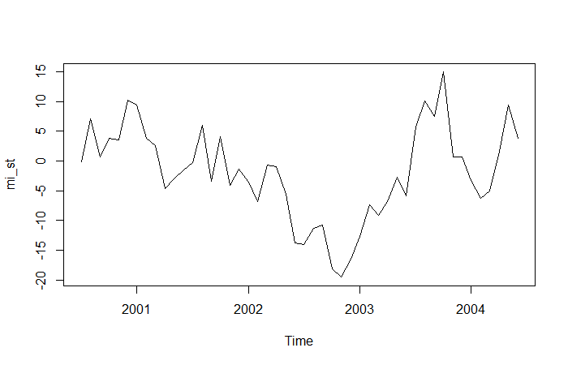

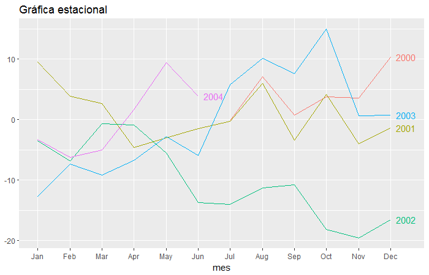

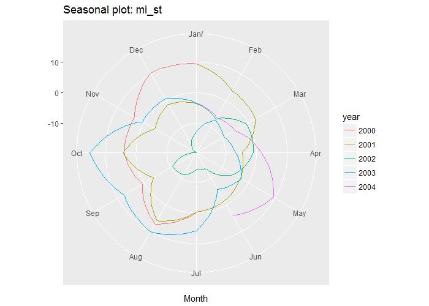

## Autocorrelación de series temporales
Una forma de obtener información sobre el tipo de serie temporal y sus dependencias es trazar una gráfica de cada observación contra otra observación que ocurrió algún tiempo atrás, esto tecnicamente se llama hacer gráficas de retraso (lag) y despues calcular la autocorrelación (ACF) de estas series.

El paquete `forecast`tiene la fucniones `gglagplot()` y `ggAcf()` que calculan y pintan los resultados.

Las graficas de retardo se hacen con  `gglagplot()` y la grafica de autocorrelación de la serie con `ggAcf()`, este ultimo es el gráfico ACF.

```{r}
#usaremos los datos calculados anteriormente
library(ggplot2)
# Crea una grafico con autoplot
# autoplot es una función de graficado muy completa y simple
autoplot(mi_st)

# Crea un grafico de restasos
gglagplot(mi_st)

# Crea un gráfico de autocorrelación ACF
ggAcf(mi_st)
```

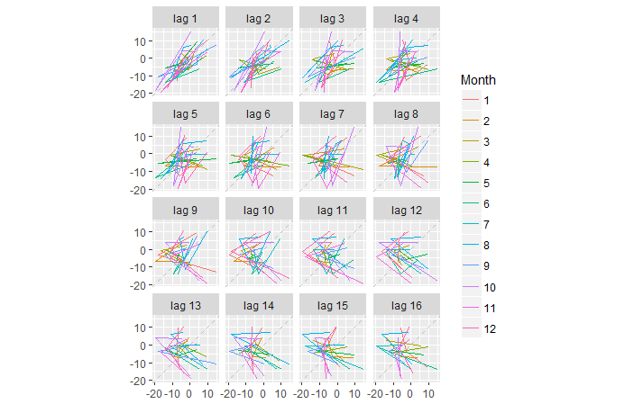

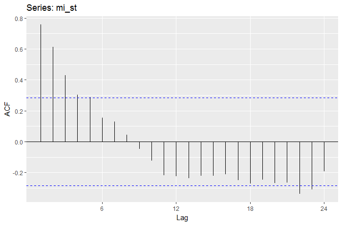

La información que nos aporta la gráfica de autocorrelación es importante y significativa, por ejemplo, es fácil identificar las series cíclicas y estacionarias con un simple vistazo, y por tanto obtener información relevante y objetiva.

Las marcas azules de la grafica de autocorrelación separan los valores, intervalos  significativos (los mayores que la linea).

```{r}
    library("zoo")
    library("forecast")
    # Pintamos una gráfic de las manchas solares por año
    autoplot.zoo(sunspot.year)# library zoo
    ggAcf(sunspot.year) # library forecast
```

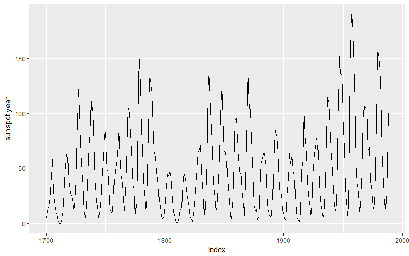

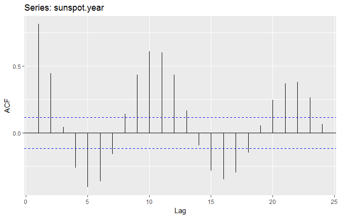

## Ruido blanco
El ruido blanco es una forma de decir que los datos son puramente aleatorios y por tanto impredecibles. Se puede realizar una prueba de *Ljung-Box*  utilizando la función `Box.test`del paquete `stats` para confirmar la aleatoriedad de una serie. Un valor **p mayor que 0.05** sugiere que los datos no son significativamente diferentes del ruido blanco es decir que son impredecibles.

Por ejemplo, vamos a comprobar la llamada *"Hipótesis del mercado eficiente"* que establece que los precios de los activos reflejan toda la información disponible. Una consecuencia de esto es que los cambios diarios en los precios de las acciones deben comportarse como **ruido blanco**.

La consecuencia para los brokers es que el mejor pronóstico del precio futuro es el precio actual. Vams a probar esta hipótesis con los precios de las acciones de *google*.


```{r}
library("quantmod") # para leer los datos

    val1<-getSymbols("goog", from ="2010-01-01", to ="2015-12-31", src ="yahoo", warning= "FALSE",adjust = TRUE,auto.assign=FALSE)

    val1<-Cl(val1) # nos quedamos solo con los cierres

        # Pintamos la serie de cierres
    #autoplot(val1)
    plot.zoo(val1, ylab="Google", main="evolucion de Google desde 2010", xlab="año")

    # Pintamos las diferencias la resta del valor de ayer menos hoy
    autoplot(diff(val1))

    # ACF pintamosla acutocorrelacion de la serie de diferencias
    ggAcf(diff(val1))

    # Realizamos el test Ljung-Box sobre las diferencias
    Box.test(diff(val1), lag = 10, type = "Ljung")
```
## Pronósticos sencillos
Llamamos predicción simple a una proyección a futuro de los datos actuales calculada como repeticion del valor actual. Esto es lo que los ingleses denoinan el pronostico de tontos, pero que nos vale para comparar los resultados de los modelos.

La librería `forecast`contiene algunas funciones interesantes como `naive()`y `checkresiduals()` para la representación de pronósticos. Por ejemplo para ver el pronóstico ingenuo visualmente usaremos `naive(num_intervalos_futuros)`. Esta función crea un objeto  `forecast`cuya representación gráfica es automática, veamos cómo usarlo:

```{r}
    # Usamos naive() del paquete forecast
    # para predecir 100 valores a futuro de la serie de google
    pronostico_google <- naive(val1, 100)

    # Pintamos los datos de pronostico
    autoplot(pronostico_google)
    head(summary(pronostico_google))
    
    #calculamos los residuos del pronóstico
    # ojo usarems la funcion pipe (tubería)
    val1 %>% naive(100) %>% checkresiduals()
    # si los residuos son ruido blanco, es un buen pronóstico
```

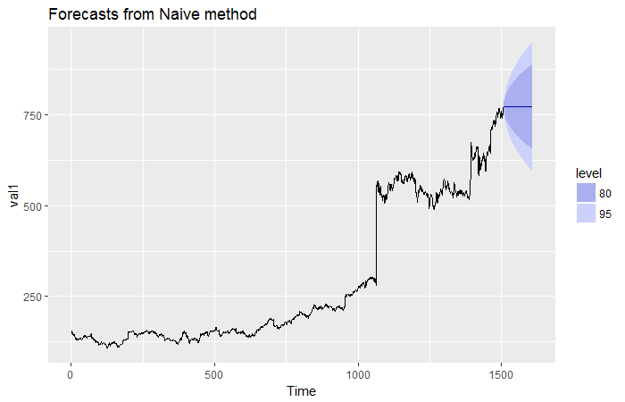


# LIBRERÍA `quantstrat`
La librería [quantstrat](https://www.rdocumentation.org/packages/quantstrat/versions/0.8.2)  ha sido desarrollado por *Brian Peterson*, y es uno de los más completos y completos para análisis financieros. Con él, tendremos una base poderosa sobre la que generar sistemas de inversión propios y desarrollar nuestra imaginación de trader.

El paquete está configurado como un sistema de capas, cuyo objetivo final es la estrategia de inversión. Una estrategia es la **programación sistemática de órdenes de compra- venta** sobre un activo (por ejemplo acciones de un valor de bolsa). El resultado de aplicar este sistema de compra-venta sobre el activo en datos históricos nos dará unos resultados.

Si la estrategia es buena incrementará el patrimonio inicial y si es mala perderemos dinero.

Las estrategias son una forma racional de invertir en bolsa. Supone hacer el esfuerzo de crear reglas y una esructura sistemática de inversión que se ejecutará de manera automatizada sin que los sentimientos intervengan durante el proceso.

## Instalacion de `quantstrat`
Existen dos formas de hacerlo la facil y la dificil:

La facil es instalarlo a través de *devtools*, **RECOMENDAMOS encarecidamente esta opción** ya que el desarrollador solo actualiza la version de *github* que es la que se descarga con esta herramienta.

```{r eval=FALSE}
install.packages("devtools")
require(devtools)
install_github("braverock/blotter") # dependency
install_github("braverock/quantstrat")
```

La dificil es la forma manual, que es algo complicada. Lo primero es instalar una serie de dependencias antes de descargar la versión *zip* de la librería
 
```{r}
rm(list = ls()) # limpiamos las variables
install.packages("FinancialInstrument")
install.packages("PerformanceAnalytics")
install.packages("foreach")
```
 
Despues debemos descargar los ficheros de dos paquetes : 

 - [enlace a quantstrat_0.9.1739.zip ](http://download.r-forge.r-project.org/bin/windows/contrib/3.2/quantstrat_0.9.1739.zip)

  - [enlace  blotter](http://download.r-forge.r-project.org/bin/windows/contrib/3.2/blotter_0.9.1741.zip)

Una vez descargados en el directorio de trabajo actual podemos instalarlos con el siguiente código.

```{r eval=FALSE}
getwd()
install.packages("blotter_0.9.1741.zip")
install.packages("quantstrat_0.9.1739.zip", repos = NULL)
#otros paquetes que necesitamos son
install.packages("FinancialInstrument")
install.packages("PerformanceAnalytics")
install.packages("foreach")
```


## Estrategias, la base `quantstrat`

Para configurar un sistema de inversión, `quantstrat` requiere definir tres objetos:

 - cuenta
 - cartera (portafolio)
 - órdenes
 
La unión de estos tres objetos define una estrategia.

Una **cuenta** es la billetera del sistema, en la cuenta se refleja el resutado contable de las inversiones, tras aplicar las estrategias. Por ejemplo, en la cuenta hay que especificar el importe inicial, el dinero que vamos a apostar por cada compra, las carteras de  valores  sobre las que se aplican las órdenes etc. 

Una **cartera** es un grupo de valores o un único valor sobre los que actuar o aplicar una estrategia. Es el conjunto de acciones sobre las que invertimos.

Las **órdenes** definen los puntos de entrada y salida de la inversión.

## Primeros pasos

Una vez cargado el paquete `quantstrat` lo primero que necesitamos es **inicializar**, es decir, definir los parámetros iniciales de base del sistema.
Estos parámetros son por ejemplo las fechas de inicio, fin y de simulación, la moneda de uso, la zona horaria.

Además es importante obtener los datos de partida por ejemplo usando la función `getSymbols` de `quantmod` que vimos en apartados anteriores, en este caso para trabajar con datos de telefónica del mercado continuo español.

Para crear una cartera hay que llamar a la función:

 `initPortf(nombre_cartera, symbols="acciones", initDate, moneda)`

Para crear una cuenta hay que llamar a la función:

 `initAcct(nombre_cuenta, portfolios=nombre_cartera, initDate=initDate, currency='EUR')`

Por ultimo inicializamos la órdenes con `initOrders(nombre_cartera, initDate)`

```{r eval=FALSE}
    # Inicializar una estrategia con quantstrat
    library("quantstrat")
    # 1. definimos los parametros de contorno
        currency('EUR')
        valores <- "TEF.MC"
        stock(valores, currency="EUR", multiplier=1)
        initDate = "1999-01-01" # dia de inicio del backtest
        from = "2003-01-01" # fecha inicio de los datos
        to ="2015-12-31" # fecha fin de los datos
        Sys.setenv(TZ="Europe/Madrid") # establecemos la zona horaria
        #Sys.setenv(TZ="UTC")
    
    # leemos datos 
    # Cargamoslibrary("quantmod")
    require("quantmod")
    # Obtenemos los valores diarios de las acciones
    getSymbols("TEF.MC", from=from, to=to, src="yahoo", adjust=TRUE)
    plot(Cl(TEF.MC))
```

Una plantilla de trabajo con esta librería sería la siguiente:
```{r eval=FALSE}
    # inicio de estrategias
    require(quantmod)
    require(quantstrat)
    #require(IKTrading)
     
    getSymbols("SAN.MC", from="1999-01-01")
     
    initDate='1990-01-01'
    currency('EUR')
    Sys.setenv(TZ="UTC")
    symbols <- "SAN.MC" #c("spread")
    stock(symbols, currency="EUR", multiplier=1)
    
    # nombramos la estrategia
    strategy.st <- portfolio.st <- account.st <-"BANCO SAN"
    rm.strat(portfolio.st) # limpia la memoria de carteras
    rm.strat(strategy.st)  # limpia la memoria de estrategias
    # inicializa la cartera, cuenta y ordenes
    initPortf(portfolio.st, symbols=symbols, initDate=initDate, currency='EUR')
    initAcct(account.st, portfolios=portfolio.st, initDate=initDate, currency='EUR')
    initOrders(portfolio.st, initDate=initDate)
    
    # Crea la estartegia con un nombre
    strategy(strategy.st, store=TRUE)
```


### Ejemplo
Veamos un ejemplo completo de sistema, primero inicializamos todas las variables, creamos la estrategia, cartera y cuenta


```{r}
## estrategia de compra en los años impares
require(quantstrat)
require(PerformanceAnalytics)
 
initDate="2000-01-01"
from="2008-01-01"
to="2017-12-31"
options(width=70) # opciones de R
options("getSymbols.warning4.0"=FALSE)
 
currency('USD')
Sys.setenv(TZ="UTC")
 
symbols <- 'SPY'
# Leemos los datos evitando los mensajes de alerta
suppressMessages(getSymbols(symbols, from=from, to=to, src="yahoo", adjust=TRUE))  
 
stock(symbols, currency="USD", multiplier=1)

# Creamos un indicador simple que dice solo si un año es par o impar
# cada serie temporal que se lee con getSymbols tien la fecha almacenada en el index
# esta fecha está compluesta por un numero YYYY-MM-DD, por lo que si leemos el ultimo 
# valor de la fecha , caracter 4 sabemos si es par o impar con el mod (resto) %%2
# si el resto es 1 es impar
Indicador_ano_impar <- as.numeric(as.character(substr(index(SPY), 1, 4)))%%2 == 1
# creamos una serie temporal con esto  
Indicador_ano_impar <- xts(Indicador_ano_impar, order.by=index(SPY))
# unimos esta serie a la del SPY con cbind (columnas unir)  
SPY <- cbind(SPY, Indicador_ano_impar)
# vemos los nombres de las columnas de la serie y la ultima es la nueva la 7
# la cambiamos de nombre
colnames(SPY)[7] = "Indicador_ano_impar"

## segir aqui

strategy.st <- portfolio.st <- account.st <- "Indicador_ano_impar"

rm.strat(portfolio.st) # limpia la memoria de carteras
rm.strat(strategy.st) # borramos la memoria

# Inicializamos la cartera cuenta y ordenes
initPortf(portfolio.st, symbols=symbols, initDate=initDate, currency='USD')
initAcct(account.st, portfolios=portfolio.st, initDate=initDate, currency='USD')
initOrders(portfolio.st, initDate=initDate)
strategy(strategy.st, store=TRUE)

# Añadimos las señales
# añadimos la señal de entrada por umbral gte = greater than or equal = mayor o igual que
# es decir cuando pase de 0 a 1 será gte TRUE
add.signal(strategy.st, name = sigThreshold, 
           arguments = list(column = "Indicador_ano_impar", threshold = 0.5,
                            relationship = "gte", cross = TRUE),
                            label = "entradaLargos")
 
add.signal(strategy.st, name = sigThreshold, 
           arguments = list(column = "Indicador_ano_impar", threshold = 0.5,
                            relationship = "lte", cross = TRUE),
                            label = "salidaLargos")
 
# aplica la señal  
tmp <- applySignals(strategy = strategy.st, mktdata=SPY)
    #str(tmp) 
# Añadimos las reglas 
# esta regla es para entrar en la posicion
add.rule(strategy.st, name="ruleSignal", 
         arguments=list(sigcol="entradaLargos", sigval=TRUE, ordertype="market", 
                        orderside="long", replace=FALSE, prefer="Open", orderqty = 1), 
         type="enter", path.dep=TRUE)
# regla para salir de la posición 
add.rule(strategy.st, name="ruleSignal", 
         arguments=list(sigcol="salidaLargos", sigval=TRUE, orderqty="all", 
                        ordertype="market", orderside="long", 
                        replace=FALSE, prefer="Open"), 
         type="exit", path.dep=TRUE)
 
#Aplicamos la estrategia completa
t1 <- Sys.time() # hora de inicio del calculo
out <- applyStrategy(strategy=strategy.st,portfolios=portfolio.st)
t2 <- Sys.time()
print(t2-t1) # tiempo en el calculo de la estrategia
 
#Actualizamos el portafolios, la cartera
updatePortf(portfolio.st)
dateRange <- time(getPortfolio(portfolio.st)$summary)[-1]
# actualizamos la cuenta
updateAcct(portfolio.st,dateRange)
updateEndEq(account.st)

# pintamos la grafica del resultado
chart.Posn(portfolio.st, 'SPY')

```


### Ejemplo 2
```{r eval=FALSE}
#
    require(quantmod)
    require(quantstrat)

    initdate='1990-01-01'
    currency('USD')
    Sys.setenv(TZ="UTC")
    symbols <- c("SPY")
    stock(symbols, currency="USD", multiplier=1)
    getSymbols(symbols, from=initDate) # lee los datos
    
    # Definimos la cantidad inicial y la apostada en cada orden
    initeq <- 100000 # cantidad inicial de dinero
    tradesize <- 100000 # cantidad apostada en cada operacion en la moneda definida

    # Definimos los nombres de strategy, portfolio y account
    strategy.st <- "Esperanza"
    portfolio.st <- "Esperanza"
    account.st <- "Esperanza"

    # limpiamos memoria siempre antes de calcular
    rm.strat(strategy.st)
    rm.strat(portfolio.st) # limpia la memoria de carteras
    
    # Inicializamos la cartera (portfolio)
    initPortf(portfolio.st, symbols = symbols, initDate = initdate, currency = "USD")
    # Inicializamos la cuenta
    initAcct(account.st, portfolios = portfolio.st, initDate = initdate, currency = "USD", initEq = initeq)
    # Inicializamos las ordens
    initOrders(portfolio.st, initDate = initdate)
    # Guardamos la estrategia
    strategy(strategy.st, store = TRUE)

    # Indicadores
        # Añadimos un indicador a la estrategia
        add.indicator(strategy = strategy.st, 
              name = "SMA", # Nombre de la funcion indicador 
              arguments = list(x = quote(Cl(mktdata)), n = 200), # indicar los parámetros del indicador 
              label = "sma.200")
```


## Indicadores

En el ejemplo anterior hemos visto una estrategia completa fácil en la que hemos programado unas señales y reglas de manera manual, pero lo habitual es establecer esas señales en funcion de los vlores de un **indicador**. Según los cruces o valores umbral del indicador programaremos las señales y las ordenes de entrada y salida sistema, es decir cuando compramos y vendemos.

Básicamente el proceso a seguir en toda estrategia consta de 3 fases en las que hay que definir tres objetos en `quandstrat`que son:

 1. Indicadores
 2. Señales
 3. Reglas
 
Un indicador es una transformación de los datos de mercado que se usa como generador de señales o como filtro. Los indicadores suelen verse como el esqueleto de los sistemas de inversión.

Los clásicos están incluidos en la programación de muchos de los paquetes, entre ellos `quantmod` y `TTR`, como por ejemplo la media movil en todas sus variantes SMA o el indicador de fuerza relativa RSI. Estos indicadores clásicos suelen tener un solo parámetro que indica el perido de datos anterior que se usa para el cálculo.


```{r eval=FALSE}
    # Expresión de algunos indicadores clásicos del paquete TTR
    SMA(x = Cl(GDX), n = 50)
    RSI(price = Cl(GDX), n = 14)
```


### Añadir indicador
Lo más atractivo de R es que podemos programar, y esto nos abre multitud de nuevas posibilidades, y entre ellas programar un indicador propio y añadirlo a nuestra estrategia.

Para añadir un indicador a la estrategia usaremos la funcion `add.indicator`, esta funcion necesita los siguientes argumentos:

 - `add.indicator(nombre estrategia,nombre_funcion_indicador, lista(argumentos_de_la_funcion_indicador))`

En la lista de argumentos se incluye la llamada a `quote(Cl(mktdata))` que representa los datos de entrada temporales, la serie temporal sobre los que se aplica el indicador, que puede ser unica como la anterior (cierres de valores) o más compleja según la función del indicador( por ejemplo esta otra incluye apertura, max, min y cierre `quote(OHLC(mktdata))`) o incluso varias series temporles de valores distintos.

Por ejemplo para añadir a la estrategia un indicador basado en la media movil de 50 periodos haremos:

```{r eval=FALSE}
# añadir SMA 50 a la estrategia
add.indicator(strategy = strategy.st, 
              name = "SMA", # nombre de la funcion del indicador
              arguments = list(x = quote(Cl(mktdata)), n = 50), # listado de argumentos de la funcion
              label = "SMA_50") # etiqueta del indicador
```

### Crear un indicador propio
Para añadir un indicador nuevo debemos simplemente definir la función de calculo de dicho indicador y llamarla con su nombre y argumentos desde `add.indicator()`

veamos un ejemplo concreto para crear un RSI de 3.5 como media de los RSI3 y RSI4. Este nuevo indicador tiene en cuenta el impacto de los 3 y 4 días anteriores, pero al hacer la media reduce el ruido de cada uno.

Para hacerlo lo primero será crear una función `RSI_media`  que nos devolverá el valor del indicador. Después añadimos esta función con una etiqueta a la estrategia. 

```{r eval=FALSE}
    # Creamos la funcion RSI_avg 
    RSI_media <- function(price,n1,n2) {
        # RSI 1 n1
        rsi_1 <- RSI(price = price, n = n1)
        # RSI 2 coje el perido n2
        rsi_2 <- RSI(price = price, n = n2)
        # RSI_avg se calcula como la media de ambas rsi_1 y rsi_2
        RSI_avg <- (rsi_1 + rsi_2)/2
        # Definimos el nombre de la columan de los datos de la futura serie temporal de RSI_avg
        colnames(RSI_media) <- "RSI_media"
        return(RSI_media)
        }

    # Añadimos esta funcion a la estrategia como indicador con los valores de n1 = 3 y n2 = 4
    add.indicator(strategy.st, name = "RSI_media",
                  arguments = list(price = quote(Cl(mktdata)), n1 = 3, n2 = 4),
                  label = "RSI_3_4")
```

#### David Varadi Oscillator (DVO)
Vamos a crear un indicador algo más complejo, por ejemplo el David Varadi Oscillator (DVO). En realidad se trata simplemente de crear una función cuya salida es una serie temporal, una columna de datos fechados.

Este indicador inventado por *David Vradi* trata de buscar oportunidades de compra en una profundidad temporal dada. El indicador primero calcula el ratio entre el precio de cierre y la media de los máximos y mínimos. Despuñes aplica una media movil SMA para suavizar  el ruido, normalmente de periodo bajo como 2 días. Finalmente usa la función  `runPercentRank()` para sacar un porcentaje de ese rango y lo multiplica por 100 para normalizarlo, convertirlo en 0-100.

Lo que hace el indicador es obtener el rango de percentil del valor actual respecto a los últimos n datos anteriores del rango. Llamaremos al indicador DVO y le pasamos algunos valores por defecto

```{r eval=FALSE}
# library(quantstrat) TTR , quantmod necesarias
    # Creamos la funcion DVO 
    DVO <- function(HLC, navg = 2, percentlookback = 126) {
                # Calculamos el ratio entre los recios  de cierre y la media max min
                ratio <- Cl(HLC)/((Hi(HLC) + Lo(HLC))/2)
                # hace una media movil para suavizar el valor
                avgratio <- SMA(ratio, n = navg)
                # Convierte ratio en valores 0-100 usando runPercentRank()
                out <- runPercentRank(avgratio, n = percentlookback, exact.multiplier = 1) * 100
                # nombra la columna
                colnames(out) <- "DVO"
                return(out)
                }
```

Para aplicar este indicador en una estrategia haríamos:
```{r eval=FALSE}
    # Añadimos el indicador a la estrategia
    add.indicator(strategy = strategy.st, name = "DVO", 
              arguments = list(HLC = quote(HLC(mktdata)), navg = 2, percentlookback = 126),
              label = "DVO_2_126")
    # Lo usamos en la estrategia con applyIndicators para testear 
    # lo que hace es calcular el indicador a los datos 
    test <- applyIndicators(strategy = strategy.st, mktdata = OHLC(SPY))

    # est linea aplica el indicador a los dias especificados
    test_subset <- test["2013-09-01/2013-09-05"]
    test_subset
```

## Señales
Una señal es una interacción de los datos del mercado(o en general de una serie temporal) con indicadores, que indica si se desea comprar o vender un activo. Las señales mandan un aviso, una señal, en el momento en que se cumple una determinada condición. Una señal se puede activar por una variedad de razones, por ejemplo, puede saltar si un indicador como una media movil corta a otro indicador media movil de periodo más largo.

También se puede activar una señal cuando un indicador oscilador pasa de estar por encima de una determinada cantidad establecida (umbral) a más abajo.

En `quandstrat` se pueden usar los siguientes tipos de señales:

    - `sigThreshold`: Este tipo de señal es la que evalua evalúa si un valor está por encima o por debajo de cierta cantidad. La señal sigThreshold es mixta y puede usarse tanto como argumento cruzado **sigCrossover** (cross = TRUE lo que implica que solo da resultado positivo la primera vez que se cumple), o permanente **sigComparison** (cross = FALSE) .
    - `sigCrossover` es la señal usada para corte de lineas, dando positivo cada vez que se corta y solo en ese instante.
    - `sigComparison` es una señal que da resultado positivo **siempre** que se cumpla la condición de partida, al contrario que la anterior mantiene el resultado positivo durante el tiempo. Es una forma simple y útil de comparar dos cantidades, como dos promedios móviles. A menudo, una señal sigComparison no crea una señal de compra o venta por sí misma y fundamentalmente se utilizan como filtro.
    - `sigFormula` utiliza la evaluación de cadenas para ofrecer una flexibilidad inmensa al combinar varios indicadores y señales que ya ha agregado a su estrategia para crear señales compuestas.

Es importante insistir que a diferencia de *sigComparison* que siempre indicará si una condición se mantiene o no, *sigCrossover* solo da un resultado positivo en el momento en que la señal aparece _por primera vez_, y luego no. Esto es útil para una señal que se utilizará para iniciar una transacción.

## Uso de señales
Vistos lo tipos de señales en `quandstrat`, para usarlas debemos especificar varias cosas: primero el nombre de la estrategia sobre la que se aplicará, después el tipo de señal (**name**)que vamos a definir, luego el indicador (**arguments**) sobre el que la usaremos, incluyendo los parametros de este indicador y en qué modo interactuamos con él (**relationship**).

El parámetro **relationship** puede adoptar cualquiera de los siguientes valores de relacion:
 
  * "gt" mayor que 
  * "lt" menor que
  * "eq" igual que
  * "gte" mayor o igual que
  * "lte" menor o igual que

Veamos ejemplos de definición de señales:

```{r eval=FALSE}

# Ejemplo de definición de señal sigThreshold 
# este tipo se usa con indicdores cíclicos
add.signal(strategy.st, name = "sigThreshold", 
           arguments = list(column = "DVO_2_126", 
                            # Establecemos el umbral minimo
                            threshold = 20, 
                            # Será positivo si es menor que ese umabral
                            relationship = "lt", 
                            cross = FALSE),  # no nos interesa el cruce, sino siempre que esté por debajo
           label = "Umbral_largos") # nombre de la señal

# Ejemplo de definición de señal sigCrossover
add.signal(strategy.st, name = "sigCrossover",
           arguments = list(columns = c("SMA50", "SMA200"),
                            relationship = "lt"),
           label = "Filtro_entrada")

# Ejemplo de definición de señal sigComparison 
add.signal(strategy.st, name = "sigComparison", 
           #Buscamos relacionar las medias moviles de SMA50 y SMA200
           arguments = list(columns = c("SMA50", "SMA200"), 
                            # definimos que sea positivo si SMA50 en mayor q SMA200  --> gt
                            relationship = "gt"),
           # nombramos la señal al gusto
           label = "filtro_Largo")
```


La última función de señal *sigFormula* puede parecer complicada al principio, pero con la implementación y el etiquetado adecuados de la señal, una señal *sigFormula* resulta ser la más simple de las declaraciones de programación lógica encapsuladas en alguna estructura sintáctica de quantstrat.

```{r eval=FALSE}
add.signal(strategy.st,
            name = "sigFormula", 
            arguments = list(formula= "if statement", 
                        cross=TRUE),
            label="etiqueta")
```

Una vez definida las señales, para aplicarlas sobre la estrategia en unas fechas concretas  usaremos la función *applySignals*. Esta función lo que hace es simplemente añadir una columna nueva más a los datos de la estrategia con los resultados de la señal 0 o 1 dependiendo de si está activa o no.

```{r eval=FALSE}
test_init <- applyIndicators(strategy.st, mktdata = OHLC(SPY))
test <- applySignals(strategy = strategy.st, mktdata = test_init)

```

### Combinar señales
Muchas veces necesitaremos combinar el resultado de dos señales para crear otra nueva señal. Para ello la señal sigFórmula es la opción que elegiremos.

 Desea ingresar en una posición cuando tanto longfilter 
Escribir una función sigFormula es tan simple como escribir el argumento de una "instrucción if" en la base R dentro de la función fórmula(). En este caso, desea crear una señal etiquetada longentry, que es verdadera cuando tanto longfilter como longthreshold cruzan a true al mismo tiempo.

```{r}
# Añadiremos una señal compleja que toma sus argumentos de dos señales anteriores.
#Add a sigFormula signal to your code specifying that both longfilter and longthreshold must be TRUE, label it longentry
add.signal(strategy.st, name = "sigFormula",
           
           # Especificamos como argumento los nombres de las señales definidas anteriormente
           # y la formula que deseamos, en este caso & que sera TRUE si ambos son TRUE
           arguments = list(formula = "Filtro_entrada & Umbral_largos", 
                            # especificamos que será tipo sigCrossover 
                            cross = TRUE),
           # nombramos esta nueva señal
           label = "entrada_larga")
```

## Reglas
Las reglas son la tercera pata de la mesa de `quantstrat`, las otras dos que hemos visto son los indicadores y las señales.

Las reglas son las que nos *definen las acciones* a llevar a cabo a partir de las señales que vemos. Las reglas en `quantstrat` pueden llegar a ser muy complejas, veremos aquí los detalles para que pueda ayudarlo a comprender la mecánica general de las reglas. 


```{r eval=FALSE}
# Ejemplo de regla en quantstrat
add.rule(strategy.st, name = "ruleSignal", 
         arguments = list(sigcol = "filtro_salida", sigval = TRUE, orderqty = "all", 
                        ordertype = "market", orderside = "long", 
                        replace = FALSE, prefer = "Open"), 
         type = "exit")
```

Como vemos la definición de una regla sigue el mismo patrón que las señales, pero usando la función `add.rule()`. Este comando parece complejo, pero en realidad cada argumento es bastante simple. 

### sigcol

Primero, `add.rule()` toma en la lista de argumentos el llamado `sigcol`, que especifica la columna de datos de una señal en la serie temporal de la estrategia.

Al igual que las señales y los indicadores, todas las reglas hacen referencia a una columna que ya está presente en la estrategia, es decir a una columna de la data frame de la estrategia y debemos poner a cuál.

Las reglas se basan en señales y, por lo tanto, deben hacer referencia a las columnas de **señal** en su estrategia.

### sigval

Ahora que ha especificado la columna que contiene la señal relevante en su estrategia, el siguiente argumento para especificar en add.rule() es *sigval*, o el valor que su señal debe tomar para activar la regla.

Todas las salidas de señal son 1s o 0s. Efectivamente, una señal está "encendida" o "apagada" en cualquier momento dado. Para nuestros propósitos, esto es equivalente a dos posibles valores lógicos: VERDADERO o FALSO. Al especificar *sigval* en el comando add.rule(), debe indicar si la regla se activa cuando el valor de la señal es TRUE o FALSE.

Para continuar con la nueva regla de salida en su estrategia, hay que especificar que debe ocurrir en una transacción cuando *filterexit* sea igual a TRUE.


## Especificación de orderqty en add.rule ()

Ahora que tiene una idea del primer conjunto de argumentos en la función add.rule (), es hora de pasar a los argumentos más importantes: el orden real que se compra o se vende. El argumento `orderqty` en `ruleSignal` especifica exactamente la cantidad de un activo que desea comprar o vender, en números de acciones.

Sin embargo, una característica destacada del tipo de regla de salida es que puede reducir su posición a cero instantáneamente con el argumento all (por lo tanto, salir). Este es el mecanismo que implementaremos en este ejercicio.

```{r}
# Fill in the orderqty argument in add.rule()
add.rule(strategy.st, name = "ruleSignal", 
         arguments = list(sigcol = "filterexit", sigval = TRUE, orderqty = "all",
                        ordertype = "market", orderside = "long", 
                        replace = FALSE, prefer = "Open"), 
         type = "exit")
```

## ordertype
Especificando ordertype en add.rule ()

Hasta este punto, ha especificado la columna de señal, el valor de la señal y la cantidad de orden asociada a su regla. A continuación, especificará el tipo de orden que ejecutará (ordertype).

Si bien hay varios tipos de órdenes en quantstrat, para el alcance de este curso, se apegará a las órdenes del mercado (ordertype = "market").

Una orden de mercado es una orden que establece que comprará o venderá el activo al precio prevaleciente, independientemente de las condiciones del mercado. Un tipo alternativo de órdenes es una orden limitada, que especifica que la transacción solo tendrá lugar si se cumplen ciertas condiciones de precio (es decir, si el precio cae por debajo de un cierto umbral adicional en el día del pedido). La mecánica de las órdenes limitadas está fuera del alcance de este curso.

## Orderside
El siguiente argumento crítico para especificar en su orden es Orderside, que puede tomar dos valores: `long` o `short`. 
En quantstrat, los intercambios de lado largo y corto se separan en silos por separado para que quantstrat sepa si una operación es larga o corta. 

Una operación larga es aquella que se beneficia comprando un activo con la esperanza de que el precio del activo aumente.

Una operación corta es aquella que vende un activo antes de poseerlo, con la esperanza de volver a comprarlo más tarde a un precio inferior.

Para su estrategia, querrá tomar solo pedidos largos.

## replace

En quantstrat, el argumento replace especifica si se ignoran o no todas las otras señales en la misma fecha cuando la estrategia actúa sobre una señal. Por lo general, esta no es la calidad deseada en un sistema comercial bien diseñado. Por lo tanto, para su regla de salida, debe establecer reemplazar a FALSO.

Además, trabajarás con una nueva regla. Anteriormente, la regla de salida con la que trabajaba era cuando el entorno del mercado ya no era propicio para un intercambio. En este caso, trabajará con una regla que vende cuando el DVO ha cruzado cierto umbral. En particular, ahora trabajará con la regla thresholdexit.

```{r}
# Fill in the replace argument in add.rule()
add.rule(strategy.st, name = "ruleSignal", 
         arguments = list(sigcol = "thresholdexit", sigval = TRUE, orderqty = "all", 
                        ordertype = "market", orderside = "long", 
                        replace = FALSE, prefer = "Open"), 
         type = "exit")
```

## prefer 

Por último, de los argumentos de la regla básica, está el aspecto del argumento prefer. En quantstrat, las órdenes tienen un mecanismo de "siguiente barra". Es decir, si ganas una señal el martes, lo más temprano que una posición se cumpliría realmente sería el miércoles siguiente. Sin embargo, esto se puede resolver colocando órdenes para ejecutar en el próximo precio de apertura posible, en lugar de esperar a que pase todo un día antes de poder comprar / vender realmente el activo.

```{r}
# Fill in the prefer argument in add.rule()
add.rule(strategy.st, name = "ruleSignal", 
         arguments = list(sigcol = "thresholdexit", sigval = TRUE, orderqty = "all", 
                        ordertype = "market", orderside = "long", 
                        replace = FALSE, prefer = "Open"), 
         type = "exit")
```

## Usar add.rule () para implementar una regla de entrada

¡Excelente! Has dominado todos los elementos del proceso de construcción de reglas en quantstrat. Aunque hasta ahora ha agregado reglas paso a paso, ahora es el momento de unir todo y ver qué tan bien ha podido absorber el material en este capítulo.

Lo contrario de una regla de salida es una regla de entrada. En las reglas de entrada, orderqty no se puede establecer en "todo" porque no hay una posición inicial en la que actuar. En este ejercicio, implementará una regla de ingreso que haga referencia a la señal de longentry en su estrategia y comprará una acción de un activo.

```{r}
# Create an entry rule of 1 share when all conditions line up to enter into a position
add.rule(strategy.st, name = "ruleSignal", 
         
         # Use the longentry column as the sigcol
         arguments=list(sigcol = "longentry", 
                        
                        # Set sigval to TRUE
                        sigval = TRUE, 
                        
                        # Set orderqty to 1
                        orderqty = 1,
                        
                        # Use a market type of order
                        ordertype = "market",
                        
                        # Take the long orderside
                        orderside = "long",
                        
                        # Do not replace other signals
                        replace = FALSE, 
                        
                        # Buy at the next day's opening price
                        prefer = "Open"),
         
         # This is an enter type rule, not an exit
         type = "enter")

```
## Implementar una regla con una función de dimensionamiento de pedidos

En quantstrat, la cantidad de un activo negociado puede no ser siempre una cantidad fija con respecto a las acciones reales. Los constructos que permiten a quantstrat variar la cantidad de acciones compradas o vendidas se llaman funciones de dimensionamiento de pedidos. Debido a la extensa sintaxis adicional en la creación de una función de tamaño de orden adecuada, la codificación de su propia función de tamaño de orden desde cero está fuera del alcance de este curso.

Sin embargo, el uso de una función de tamaño de orden precodificado es sencillo. Lo primero que debe saber es que cuando utiliza una función de tamaño de orden, el argumento orderqty ya no es relevante, ya que la cantidad de orden está determinada por la función de tamaño de orden. Llamar a una función de tamaño de orden con su llamada add.rule () es bastante sencillo. Las entradas para la función de tamaño de orden se mezclan con el resto de las entradas dentro de los argumentos con los que ha estado trabajando a lo largo de este capítulo.

En este ejercicio, usará el argumento `osFUN` para especificar una función llamada `osMaxDollar`. Esto no se transmite como una cadena, sino como un objeto. La única diferencia es que el nombre de la función de dimensionamiento de la orden no está entre comillas.

Los argumentos adicionales para esta función son `tradeSize` y `maxSize`, los cuales deben tomar el tamaño comercial, que definió varios capítulos antes. Esto ha estado disponible en su espacio de trabajo.
```{r}
# Add a rule that uses an osFUN to size an entry position
add.rule(strategy = strategy.st, name = "ruleSignal",
         arguments = list(sigcol = "longentry", sigval = TRUE, ordertype = "market",
                          orderside = "long", replace = FALSE, prefer = "Open",
                          
                          # Use the osFUN called osMaxDollar
                          osFUN = osMaxDollar,
                          
                          # The tradeSize argument should be equal to tradesize (defined earlier)
                          tradeSize = tradesize,
                          
                          # The maxSize argument should be equal to tradesize as well
                          maxSize = tradesize),
         type = "enter")
```


# ANALIZAR UN ESTRATEGIA COMPLETA

ESTRATEGIA :
Comprar si: 50 SMA > 200 SMA
              y 
              DVO<20
Vender si: 50 SMA < 200 SMA
              y 
              DVO>80

Para correr una estrategia hay que hacer los sigueintes pasos:

    1. Aplicar las estrategia a una cartera
    2. Actualizar la cartera y las fechas en las que se aplica
    3. Actualizar la cuenta 

## Ejecutando su estrategia

¡Felicitaciones por crear una estrategia en quantstrat! Para revisar, su estrategia usa tres indicadores separados y cinco señales separadas. La estrategia requiere que el umbral del indicador DVO_2_126 sea inferior a 20 y el SMA50 sea mayor que el SMA200. La estrategia se vende cuando el DVO_2_126 cruza por encima de 80, o el SMA50 cruza por debajo del SMA200.

Para que esta estrategia funcione correctamente, especificó cinco señales separadas:

    sigComparison para SMA50 es mayor que SMA200;
    sigThreshold con cruz establecida en FALSE para DVO_2_126 menos de 20;
    sigFormula para unirlos y establecer cross para TRUE;
    sigCrossover con SMA50 menor que SMA200; y
    sigThreshold con cross set en TRUE para DVO_2_126 mayor que 80.

La estrategia invierte $ 100,000 (su initeq) en cada operación, y puede tener un pequeño promedio de costo en dólares si el DVO_2_126 oscila alrededor de 20 (aunque el efecto es en su mayoría insignificante en comparación con la asignación inicial).

En este capítulo final, aprenderá a ver los resultados reales de su cartera. Pero primero, para generar los resultados, necesita ejecutar su estrategia y completar un código más repetitivo para asegurarse de que quantstrat lo registre todo. El código en este ejercicio es código que deberá copiar y pegar en el futuro.

###Instructions

 1.Use applyStrategy() to apply your strategy (strategy.st) to your portfolio (portfolio.st). Save this to the object out.
 2. Run necessary functions to record the results of your strategy, including updatePortf() and setting the daterange as well as updateAcct() and updateEndEq().
 3.Based on this information, what is the date of the last trade?


```{r}
# Use applyStrategy() to apply your strategy. Save this to out
out <- applyStrategy(strategy = strategy.st, portfolios = portfolio.st)

# Update your portfolio (portfolio.st)
updatePortf(portfolio.st)
daterange <- time(getPortfolio(portfolio.st)$summary)[-1]

# Update your account (account.st)
updateAcct(account.st, daterange)
updateEndEq(account.st)

# What is the date of the last trade?
"2015-12-23"
```
[1] "2003-11-04 00:00:00 SPY 1209 @ 82.8469578360576"
[1] "2003-11-07 00:00:00 SPY -1209 @ 83.3550303566401"
[1] "2003-11-11 00:00:00 SPY 1209 @ 82.1434723265441"
[1] "2003-11-14 00:00:00 SPY -1209 @ 83.1674369825957"
[1] "2003-11-17 00:00:00 SPY 1202 @ 82.0027817904916"
[1] "2003-11-19 00:00:00 SPY 13 @ 81.3149269126141"
[1] "2003-12-12 00:00:00 SPY -1215 @ 84.394624862679"
[1] "2003-12-17 00:00:00 SPY 1188 @ 84.4649709123541"
[1] "2003-12-19 00:00:00 SPY -1188 @ 85.8379047354679"
[1] "2004-01-26 00:00:00 SPY 1107 @ 89.8352933883476"
[1] "2004-02-05 00:00:00 SPY 17 @ 88.8771751199046"
[1] "2004-02-12 00:00:00 SPY -1124 @ 91.0761356338675"
[1] "2004-02-17 00:00:00 SPY 1099 @ 90.9818922139293"
[1] "2004-03-04 00:00:00 SPY 5 @ 90.8798000840517"
[1] "2004-03-18 00:00:00 SPY -1104 @ 88.5080635009088"
[1] "2004-03-23 00:00:00 SPY 1147 @ 86.8875112703844"
[1] "2004-03-31 00:00:00 SPY -1147 @ 89.0468909266731"
[1] "2004-04-14 00:00:00 SPY 1100 @ 88.7474170616372"
[1] "2004-04-21 00:00:00 SPY 12 @ 88.4242948197242"
[1] "2004-04-23 00:00:00 SPY -1112 @ 90.1738672633321"
[1] "2004-04-29 00:00:00 SPY 1114 @ 88.8341075490725"
[1] "2004-05-10 00:00:00 SPY 26 @ 86.2491556209151"
[1] "2004-05-13 00:00:00 SPY -1140 @ 86.5013461298178"
[1] "2004-05-20 00:00:00 SPY 1148 @ 86.2570326338416"
[1] "2004-05-26 00:00:00 SPY -1148 @ 87.9987288526183"
[1] "2004-06-07 00:00:00 SPY 1123 @ 89.393654452605"
[1] "2004-06-09 00:00:00 SPY -1123 @ 90.2447989963423"
[1] "2004-06-22 00:00:00 SPY 1111 @ 89.4826721872208"
[1] "2004-06-24 00:00:00 SPY -1111 @ 90.6137630924066"
[1] "2004-06-28 00:00:00 SPY 1105 @ 90.5821234171208"
[1] "2004-07-06 00:00:00 SPY 12 @ 88.8815381310937"
[1] "2004-07-16 00:00:00 SPY 14 @ 88.248758071904"
[1] "2004-07-29 00:00:00 SPY -1131 @ 87.4340575917991"
[1] "2004-08-06 00:00:00 SPY 1146 @ 85.1323255940912"
[1] "2004-08-12 00:00:00 SPY -1146 @ 85.1718765723996"
[1] "2004-11-11 00:00:00 SPY 1075 @ 93.0719232673771"
[1] "2004-11-15 00:00:00 SPY -1075 @ 94.3992829595591"
[1] "2004-11-30 00:00:00 SPY 1056 @ 94.0009737487592"
[1] "2004-12-10 00:00:00 SPY -1056 @ 94.7338611033941"
[1] "2004-12-28 00:00:00 SPY 1030 @ 96.5580225549442"
[1] "2005-01-19 00:00:00 SPY -1030 @ 95.5895617483965"
[1] "2005-01-21 00:00:00 SPY 1059 @ 94.2769368997169"
[1] "2005-02-07 00:00:00 SPY -1059 @ 96.2458745729271"
[1] "2005-02-10 00:00:00 SPY 1037 @ 95.7736526933884"
[1] "2005-02-14 00:00:00 SPY -1037 @ 96.5980440307552"
[1] "2005-02-23 00:00:00 SPY 1042 @ 95.1893710017315"
[1] "2005-02-25 00:00:00 SPY -1042 @ 96.2618798016492"
[1] "2005-03-10 00:00:00 SPY 1024 @ 97.006234590446"
[1] "2005-03-17 00:00:00 SPY 19 @ 95.4935143684339"
[1] "2005-03-23 00:00:00 SPY 8 @ 93.9722829469485"
[1] "2005-04-01 00:00:00 SPY -1051 @ 95.3222054728198"
[1] "2005-04-04 00:00:00 SPY 1049 @ 94.3017315393874"
[1] "2005-04-06 00:00:00 SPY -1049 @ 95.1775709164764"
[1] "2005-04-12 00:00:00 SPY 1052 @ 94.7275983482366"
[1] "2005-04-13 00:00:00 SPY -1052 @ 95.2659595044338"
[1] "2005-04-15 00:00:00 SPY 1060 @ 93.0000181217213"
[1] "2005-04-21 00:00:00 SPY 18 @ 92.2366714849296"
[1] "2005-04-25 00:00:00 SPY -1078 @ 93.0964435698595"
[1] "2005-05-16 00:00:00 SPY 1070 @ 92.9678763056753"
[1] "2005-05-17 00:00:00 SPY -1070 @ 93.5383849025957"
[1] "2005-06-09 00:00:00 SPY 1033 @ 96.2141193737957"
[1] "2005-06-13 00:00:00 SPY -1033 @ 96.3748276505007"
[1] "2005-06-24 00:00:00 SPY 1021 @ 96.7153856513278"
[1] "2005-07-01 00:00:00 SPY 10 @ 96.3684752670201"
[1] "2005-07-06 00:00:00 SPY -1031 @ 97.12683911602"
[1] "2005-08-08 00:00:00 SPY 1004 @ 99.3535221425788"
[1] "2005-08-18 00:00:00 SPY 10 @ 98.4660777801881"
[1] "2005-08-26 00:00:00 SPY 7 @ 98.0062198288965"
[1] "2005-08-31 00:00:00 SPY -1021 @ 97.7722562048044"
[1] "2005-09-14 00:00:00 SPY 998 @ 99.829512233509"
[1] "2005-09-21 00:00:00 SPY 3 @ 98.6745715803002"
[1] "2005-09-30 00:00:00 SPY -1001 @ 99.3470413322365"
[1] "2005-10-05 00:00:00 SPY 1005 @ 98.2370613833183"
[1] "2005-10-11 00:00:00 SPY 26 @ 96.406001958985"
[1] "2005-10-17 00:00:00 SPY -1031 @ 96.2520675220569"
[1] "2005-10-24 00:00:00 SPY 1043 @ 95.9603937873348"
[1] "2005-10-25 00:00:00 SPY -1043 @ 96.9974522643129"
[1] "2005-10-28 00:00:00 SPY 1035 @ 95.9522901412486"
[1] "2005-11-03 00:00:00 SPY -1035 @ 98.9662453150223"
[1] "2005-11-30 00:00:00 SPY 974 @ 102.215159233548"
[1] "2006-01-03 00:00:00 SPY 9 @ 101.966939892734"
[1] "2006-01-04 00:00:00 SPY -983 @ 103.327149853062"
[1] "2006-01-23 00:00:00 SPY 957 @ 102.797724868596"
[1] "2006-01-30 00:00:00 SPY -957 @ 104.614056670089"
[1] "2006-02-01 00:00:00 SPY 956 @ 104.109066609722"
[1] "2006-02-06 00:00:00 SPY 13 @ 102.985061730178"
[1] "2006-02-09 00:00:00 SPY 6 @ 103.376017257767"
[1] "2006-02-15 00:00:00 SPY -975 @ 103.995036963928"
[1] "2006-03-01 00:00:00 SPY 950 @ 104.744379523272"
[1] "2006-03-03 00:00:00 SPY -950 @ 104.801387830189"
[1] "2006-03-07 00:00:00 SPY 950 @ 104.141647323017"
[1] "2006-03-09 00:00:00 SPY -950 @ 104.483734631404"
[1] "2006-03-22 00:00:00 SPY 938 @ 105.905045203611"
[1] "2006-04-06 00:00:00 SPY -938 @ 107.000821058813"
[1] "2006-04-10 00:00:00 SPY 933 @ 106.093132767411"
[1] "2006-04-19 00:00:00 SPY -933 @ 106.919042506118"
[1] "2006-05-15 00:00:00 SPY 938 @ 105.31627331495"
[1] "2006-05-18 00:00:00 SPY 12 @ 104.138736897255"
[1] "2006-05-24 00:00:00 SPY 11 @ 102.773118639915"
[1] "2006-05-26 00:00:00 SPY -961 @ 104.678440509468"
[1] "2006-06-06 00:00:00 SPY 949 @ 104.024254610205"
[1] "2006-06-08 00:00:00 SPY 14 @ 102.691346629112"
[1] "2006-06-13 00:00:00 SPY 8 @ 101.186708266684"
[1] "2006-06-16 00:00:00 SPY -971 @ 102.907052003296"
[1] "2006-06-20 00:00:00 SPY 970 @ 101.855723704104"
[1] "2006-06-30 00:00:00 SPY -970 @ 104.755091473002"
[1] "2006-07-14 00:00:00 SPY 970 @ 101.9542817024"
[1] "2006-07-19 00:00:00 SPY -970 @ 101.995351710224"
[1] "2006-07-24 00:00:00 SPY 972 @ 102.208904580536"
[1] "2006-07-26 00:00:00 SPY -972 @ 103.974804034594"
[1] "2006-10-03 00:00:00 SPY 907 @ 109.629354814303"
[1] "2006-10-05 00:00:00 SPY -907 @ 111.304029224103"
[1] "2006-11-02 00:00:00 SPY 876 @ 112.61571818925"
[1] "2006-11-09 00:00:00 SPY -876 @ 114.678126113835"
[1] "2006-11-28 00:00:00 SPY 864 @ 114.042912722695"
[1] "2006-11-30 00:00:00 SPY -864 @ 115.85782922144"
[1] "2006-12-08 00:00:00 SPY 853 @ 116.427056283516"
[1] "2007-01-11 00:00:00 SPY -853 @ 117.449049529143"
[1] "2007-01-18 00:00:00 SPY 843 @ 118.768045971558"
[1] "2007-01-25 00:00:00 SPY -843 @ 119.340444582785"
[1] "2007-01-26 00:00:00 SPY 837 @ 118.270317678858"
[1] "2007-02-01 00:00:00 SPY -837 @ 119.581011059258"
[1] "2007-02-13 00:00:00 SPY 837 @ 119.265786707653"
[1] "2007-02-22 00:00:00 SPY -837 @ 121.157181761295"
[1] "2007-02-27 00:00:00 SPY 826 @ 119.357039092981"
[1] "2007-03-02 00:00:00 SPY -826 @ 116.179824173923"
[1] "2007-03-06 00:00:00 SPY 873 @ 115.126280166357"
[1] "2007-03-16 00:00:00 SPY -873 @ 116.024319765602"
[1] "2007-03-19 00:00:00 SPY 861 @ 115.982674771383"
[1] "2007-03-21 00:00:00 SPY -861 @ 117.51512777333"
[1] "2007-05-01 00:00:00 SPY 802 @ 123.611582476384"
[1] "2007-05-31 00:00:00 SPY -802 @ 127.984044521567"
[1] "2007-06-07 00:00:00 SPY 785 @ 126.22673120436"
[1] "2007-06-12 00:00:00 SPY -785 @ 125.485494781463"
[1] "2007-06-13 00:00:00 SPY 796 @ 125.34391196189"
[1] "2007-06-15 00:00:00 SPY -796 @ 128.092344289999"
[1] "2007-06-19 00:00:00 SPY 779 @ 127.598848330385"
[1] "2007-06-26 00:00:00 SPY 16 @ 125.64158324467"
[1] "2007-06-29 00:00:00 SPY -795 @ 126.218715626391"
[1] "2007-07-11 00:00:00 SPY 785 @ 126.093254719933"
[1] "2007-07-13 00:00:00 SPY -785 @ 129.288459467415"
[1] "2007-07-18 00:00:00 SPY 771 @ 129.004060836367"
[1] "2007-07-30 00:00:00 SPY 35 @ 122.061610471821"
[1] "2007-08-03 00:00:00 SPY -806 @ 123.190808816308"
[1] "2007-08-10 00:00:00 SPY 810 @ 120.773498659489"
[1] "2007-08-17 00:00:00 SPY -810 @ 121.701947341627"
[1] "2007-08-29 00:00:00 SPY 817 @ 120.756766523718"
[1] "2007-08-31 00:00:00 SPY -817 @ 123.500287249344"
[1] "2007-09-21 00:00:00 SPY 779 @ 128.338641306101"
[1] "2007-10-02 00:00:00 SPY -779 @ 129.93541058953"
[1] "2007-10-22 00:00:00 SPY 777 @ 125.103067234912"
[1] "2007-10-24 00:00:00 SPY -777 @ 127.078029996201"
[1] "2007-11-09 00:00:00 SPY 804 @ 122.43897617373"
[1] "2007-11-15 00:00:00 SPY -804 @ 123.178539010909"
[1] "2007-11-16 00:00:00 SPY 811 @ 122.960025486859"
[1] "2007-11-27 00:00:00 SPY 12 @ 119.119368912215"
[1] "2007-11-29 00:00:00 SPY -823 @ 123.220549303015"
[1] "2007-12-05 00:00:00 SPY 811 @ 124.321481499513"
[1] "2007-12-07 00:00:00 SPY -811 @ 127.254508015919"
[1] "2007-12-12 00:00:00 SPY 782 @ 126.951961301543"
[1] "2007-12-18 00:00:00 SPY 29 @ 122.783546626733"
[1] "2007-12-21 00:00:00 SPY -811 @ 124.508169874045"
[1] "2009-06-23 00:00:00 SPY 1252 @ 78.4042142019373"
[1] "2009-06-29 00:00:00 SPY -1252 @ 80.7176949572702"
[1] "2009-07-06 00:00:00 SPY 1252 @ 77.9397662902533"
[1] "2009-07-14 00:00:00 SPY -1252 @ 79.2016605024789"
[1] "2009-08-26 00:00:00 SPY 1103 @ 90.1205877365573"
[1] "2009-09-02 00:00:00 SPY 16 @ 87.4390558536496"
[1] "2009-09-08 00:00:00 SPY -1119 @ 90.2608021966999"
[1] "2009-09-24 00:00:00 SPY 1058 @ 93.6932113415245"
[1] "2009-10-02 00:00:00 SPY 44 @ 89.8278430661716"
[1] "2009-10-15 00:00:00 SPY -1102 @ 95.7799741839858"
[1] "2009-10-22 00:00:00 SPY 1041 @ 95.2604862455034"
[1] "2009-10-27 00:00:00 SPY 8 @ 94.2391122942741"
[1] "2009-11-02 00:00:00 SPY 19 @ 91.6856822589097"
[1] "2009-11-09 00:00:00 SPY -1068 @ 95.0491636410232"
[1] "2009-12-04 00:00:00 SPY 1018 @ 98.4742786182327"
[1] "2010-01-06 00:00:00 SPY -1018 @ 100.491626897141"
[1] "2010-01-22 00:00:00 SPY 991 @ 98.4378867582876"
[1] "2010-02-01 00:00:00 SPY 44 @ 95.7379310881149"
[1] "2010-02-03 00:00:00 SPY -1035 @ 97.2693794379058"
[1] "2010-02-05 00:00:00 SPY 1036 @ 94.3304073658146"
[1] "2010-02-10 00:00:00 SPY 18 @ 94.7641758730295"
[1] "2010-02-12 00:00:00 SPY -1054 @ 94.7110574777571"
[1] "2010-02-24 00:00:00 SPY 1018 @ 97.4995417411739"
[1] "2010-02-26 00:00:00 SPY -1018 @ 98.0572366463451"
[1] "2010-03-29 00:00:00 SPY 962 @ 104.149863026265"
[1] "2010-04-07 00:00:00 SPY -962 @ 105.598739021655"
[1] "2010-04-19 00:00:00 SPY 930 @ 105.785402565728"
[1] "2010-04-21 00:00:00 SPY -930 @ 107.509821930501"
[1] "2010-04-28 00:00:00 SPY 932 @ 105.820958584692"
[1] "2010-05-06 00:00:00 SPY 33 @ 103.340987372324"
[1] "2010-05-07 00:00:00 SPY -965 @ 100.123245432919"
[1] "2010-05-17 00:00:00 SPY 977 @ 101.509893728511"
[1] "2010-05-19 00:00:00 SPY 2 @ 99.3499195757947"
[1] "2010-05-24 00:00:00 SPY -979 @ 96.4610652563182"
[1] "2010-06-02 00:00:00 SPY 1038 @ 96.0699632697649"
[1] "2010-06-04 00:00:00 SPY -1038 @ 96.5410678545244"
[1] "2010-06-07 00:00:00 SPY 1035 @ 95.2877459634846"
[1] "2010-06-14 00:00:00 SPY -1035 @ 98.2388217606114"
[1] "2010-06-22 00:00:00 SPY 989 @ 99.5010824293916"
[1] "2010-06-30 00:00:00 SPY 67 @ 92.8117037592083"
[1] "2010-07-07 00:00:00 SPY 24 @ 92.1061481376476"
[1] "2010-07-08 00:00:00 SPY -1080 @ 95.5624758791401"
[1] "2010-11-16 00:00:00 SPY 923 @ 107.10912927803"
[1] "2010-11-23 00:00:00 SPY -923 @ 106.642223626306"
[1] "2010-12-08 00:00:00 SPY 898 @ 110.42233992386"
[1] "2011-01-06 00:00:00 SPY -898 @ 115.254351213622"
[1] "2011-01-20 00:00:00 SPY 856 @ 115.498053371796"
[1] "2011-01-26 00:00:00 SPY -856 @ 116.879053028159"
[1] "2011-01-31 00:00:00 SPY 851 @ 115.597347760313"
[1] "2011-02-02 00:00:00 SPY -851 @ 117.700418758943"
[1] "2011-02-23 00:00:00 SPY 832 @ 118.918948504635"
[1] "2011-02-28 00:00:00 SPY -832 @ 119.884748180783"
[1] "2011-03-02 00:00:00 SPY 829 @ 118.016337889799"
[1] "2011-03-08 00:00:00 SPY 4 @ 118.819660434392"
[1] "2011-03-10 00:00:00 SPY -833 @ 118.241990543508"
[1] "2011-03-11 00:00:00 SPY 845 @ 116.906130443993"
[1] "2011-03-15 00:00:00 SPY -845 @ 114.261474121639"
[1] "2011-03-18 00:00:00 SPY 865 @ 116.797541917344"
[1] "2011-03-25 00:00:00 SPY -865 @ 118.973226180634"
[1] "2011-03-29 00:00:00 SPY 838 @ 118.637800382539"
[1] "2011-03-31 00:00:00 SPY -838 @ 120.206110213051"
[1] "2011-04-04 00:00:00 SPY 826 @ 120.958519747613"
[1] "2011-04-18 00:00:00 SPY -826 @ 118.383972410212"
[1] "2011-05-06 00:00:00 SPY 822 @ 122.327390788816"
[1] "2011-05-17 00:00:00 SPY 3 @ 120.287694440843"
[1] "2011-05-19 00:00:00 SPY -825 @ 122.200477255918"
[1] "2011-05-24 00:00:00 SPY 835 @ 120.061061513291"
[1] "2011-05-27 00:00:00 SPY -835 @ 120.904129658064"
[1] "2011-06-02 00:00:00 SPY 820 @ 119.625930825048"
[1] "2011-06-07 00:00:00 SPY 27 @ 117.577160094657"
[1] "2011-06-14 00:00:00 SPY 15 @ 116.824736962119"
[1] "2011-06-22 00:00:00 SPY -862 @ 117.567909280326"
[1] "2011-07-12 00:00:00 SPY 826 @ 119.973017034815"
[1] "2011-07-20 00:00:00 SPY -826 @ 121.230237483282"
[1] "2011-07-28 00:00:00 SPY 827 @ 118.980002328384"
[1] "2011-08-03 00:00:00 SPY 31 @ 114.479532018588"
[1] "2011-08-05 00:00:00 SPY 24 @ 110.926528758843"
[1] "2011-08-11 00:00:00 SPY -882 @ 103.182807676692"
[1] "2012-04-10 00:00:00 SPY 782 @ 127.684538407341"
[1] "2012-04-17 00:00:00 SPY 1 @ 127.582723059644"
[1] "2012-04-27 00:00:00 SPY -783 @ 130.118833309384"
[1] "2012-05-07 00:00:00 SPY 779 @ 126.351693212168"
[1] "2012-05-09 00:00:00 SPY -779 @ 125.046627619274"
[1] "2012-05-14 00:00:00 SPY 799 @ 124.315407546699"
[1] "2012-05-23 00:00:00 SPY -799 @ 121.483117291866"
[1] "2012-06-01 00:00:00 SPY 820 @ 119.780043387983"
[1] "2012-06-06 00:00:00 SPY -820 @ 120.298368578338"
[1] "2012-06-12 00:00:00 SPY 805 @ 121.982927066767"
[1] "2012-06-18 00:00:00 SPY -805 @ 124.280363746837"
[1] "2012-06-22 00:00:00 SPY 792 @ 123.861694859222"
[1] "2012-06-28 00:00:00 SPY -792 @ 123.080163227625"
[1] "2012-07-11 00:00:00 SPY 790 @ 124.866508749008"
[1] "2012-07-16 00:00:00 SPY -790 @ 126.010873352377"
[1] "2012-07-24 00:00:00 SPY 799 @ 125.778277975289"
[1] "2012-07-30 00:00:00 SPY -799 @ 128.876450258874"
[1] "2012-08-01 00:00:00 SPY 776 @ 129.043912417707"
[1] "2012-08-06 00:00:00 SPY -776 @ 129.992905277756"
[1] "2012-09-26 00:00:00 SPY 732 @ 134.755594949074"
[1] "2012-10-10 00:00:00 SPY 2 @ 134.858470135761"
[1] "2012-10-17 00:00:00 SPY -734 @ 136.224083848539"
[1] "2012-10-22 00:00:00 SPY 734 @ 133.895062616513"
[1] "2012-11-06 00:00:00 SPY 22 @ 133.081314520924"
[1] "2012-11-09 00:00:00 SPY 9 @ 128.722589033494"
[1] "2012-11-14 00:00:00 SPY 12 @ 129.274455586031"
[1] "2012-11-20 00:00:00 SPY -777 @ 129.929196389907"
[1] "2012-12-04 00:00:00 SPY 748 @ 132.295624995064"
[1] "2012-12-19 00:00:00 SPY -748 @ 136.12119556698"
[1] "2013-02-01 00:00:00 SPY 708 @ 141.909563425788"
[1] "2013-02-08 00:00:00 SPY -708 @ 142.446499686931"
[1] "2013-02-22 00:00:00 SPY 703 @ 142.38055436199"
[1] "2013-02-28 00:00:00 SPY -703 @ 143.087040766293"
[1] "2013-04-04 00:00:00 SPY 673 @ 147.06343231595"
[1] "2013-04-08 00:00:00 SPY -673 @ 146.912055281063"
[1] "2013-04-16 00:00:00 SPY 668 @ 147.877139820857"
[1] "2013-04-19 00:00:00 SPY 12 @ 146.18349942803"
[1] "2013-04-23 00:00:00 SPY -680 @ 148.501616806983"
[1] "2013-05-22 00:00:00 SPY 632 @ 158.332337925907"
[1] "2013-05-28 00:00:00 SPY -632 @ 158.048483632192"
[1] "2013-05-30 00:00:00 SPY 638 @ 156.449466068128"
[1] "2013-06-03 00:00:00 SPY 1 @ 155.011281577095"
[1] "2013-06-06 00:00:00 SPY 9 @ 152.52284575565"
[1] "2013-06-10 00:00:00 SPY -648 @ 156.411611638063"
[1] "2013-06-12 00:00:00 SPY 647 @ 155.380287522684"
[1] "2013-07-01 00:00:00 SPY 7 @ 153.386964644818"
[1] "2013-07-08 00:00:00 SPY -654 @ 155.860033234448"
[1] "2013-07-25 00:00:00 SPY 619 @ 160.007169452897"
[1] "2013-07-29 00:00:00 SPY -619 @ 160.44470373808"
[1] "2013-08-01 00:00:00 SPY 622 @ 161.690758373814"
[1] "2013-08-16 00:00:00 SPY 5 @ 157.952622050774"
[1] "2013-08-26 00:00:00 SPY -627 @ 158.646977258064"
[1] "2013-08-28 00:00:00 SPY 639 @ 155.289320708327"
[1] "2013-09-10 00:00:00 SPY -639 @ 160.406662323878"
[1] "2013-09-23 00:00:00 SPY 607 @ 162.956795401376"
[1] "2013-09-26 00:00:00 SPY 9 @ 161.838494509156"
[1] "2013-10-02 00:00:00 SPY -616 @ 160.911353621946"
[1] "2013-10-09 00:00:00 SPY 624 @ 158.474024130731"
[1] "2013-10-11 00:00:00 SPY -624 @ 161.446607753185"
[1] "2013-11-01 00:00:00 SPY 593 @ 168.242447868879"
[1] "2013-11-12 00:00:00 SPY -593 @ 169.121795170532"
[1] "2013-11-21 00:00:00 SPY 583 @ 171.062097370113"
[1] "2013-11-25 00:00:00 SPY -583 @ 173.12666021586"
[1] "2013-12-12 00:00:00 SPY 578 @ 170.746676718937"
[1] "2013-12-19 00:00:00 SPY -578 @ 173.1744394642"
[1] "2014-01-06 00:00:00 SPY 567 @ 176.334543928472"
[1] "2014-01-13 00:00:00 SPY -567 @ 176.507517838225"
[1] "2014-01-14 00:00:00 SPY 566 @ 175.18132815125"
[1] "2014-01-16 00:00:00 SPY -566 @ 177.093730957195"
[1] "2014-01-27 00:00:00 SPY 573 @ 172.077291529657"
[1] "2014-02-04 00:00:00 SPY 11 @ 168.12756602891"
[1] "2014-02-06 00:00:00 SPY -584 @ 168.733003062648"
[1] "2014-02-20 00:00:00 SPY 566 @ 176.123122189186"
[1] "2014-03-03 00:00:00 SPY -566 @ 177.449297461108"
[1] "2014-03-14 00:00:00 SPY 553 @ 177.64150970068"
[1] "2014-03-21 00:00:00 SPY -553 @ 181.186138244352"
[1] "2014-03-24 00:00:00 SPY 551 @ 180.346364511244"
[1] "2014-03-27 00:00:00 SPY 2 @ 178.329006405312"
[1] "2014-04-02 00:00:00 SPY -553 @ 181.939027382854"
[1] "2014-04-07 00:00:00 SPY 546 @ 179.487297461871"
[1] "2014-04-10 00:00:00 SPY -546 @ 180.578029093173"
[1] "2014-04-11 00:00:00 SPY 553 @ 175.809716093826"
[1] "2014-04-16 00:00:00 SPY -553 @ 179.023983741933"
[1] "2014-05-15 00:00:00 SPY 545 @ 182.122412342361"
[1] "2014-05-20 00:00:00 SPY -545 @ 182.093455958798"
[1] "2014-06-25 00:00:00 SPY 527 @ 188.436075649539"
[1] "2014-06-27 00:00:00 SPY -527 @ 189.105289001698"
[1] "2014-07-18 00:00:00 SPY 522 @ 190.43402088343"
[1] "2014-07-22 00:00:00 SPY -522 @ 192.043994757799"
[1] "2014-07-31 00:00:00 SPY 521 @ 189.716312081201"
[1] "2014-08-07 00:00:00 SPY 18 @ 187.126759599473"
[1] "2014-08-12 00:00:00 SPY -539 @ 187.776571668019"
[1] "2014-08-13 00:00:00 SPY 532 @ 188.436075649539"
[1] "2014-08-15 00:00:00 SPY -532 @ 190.55040045887"
[1] "2014-09-05 00:00:00 SPY 513 @ 194.138917313647"
[1] "2014-09-09 00:00:00 SPY -513 @ 194.37169198245"
[1] "2014-09-10 00:00:00 SPY 514 @ 193.421208511418"
[1] "2014-09-12 00:00:00 SPY -514 @ 194.071034158147"
[1] "2014-09-23 00:00:00 SPY 512 @ 193.350934585068"
[1] "2014-09-26 00:00:00 SPY 3 @ 191.665219949033"
[1] "2014-09-30 00:00:00 SPY -515 @ 192.629884559961"
[1] "2014-10-02 00:00:00 SPY 521 @ 189.209718534193"
[1] "2014-10-06 00:00:00 SPY -521 @ 192.288837391702"
[1] "2014-10-08 00:00:00 SPY 525 @ 188.420453423893"
[1] "2014-10-09 00:00:00 SPY -525 @ 191.304695423682"
[1] "2014-10-13 00:00:00 SPY 532 @ 185.58495012661"
[1] "2014-10-16 00:00:00 SPY -532 @ 178.374353409571"
[1] "2014-10-24 00:00:00 SPY 527 @ 190.252337396064"
[1] "2014-10-28 00:00:00 SPY -527 @ 191.782158146272"
[1] "2014-12-02 00:00:00 SPY 497 @ 200.542039328959"
[1] "2014-12-10 00:00:00 SPY -497 @ 200.639485553049"
[1] "2014-12-12 00:00:00 SPY 503 @ 197.453180331298"
[1] "2015-01-09 00:00:00 SPY -503 @ 202.226942270605"
[1] "2015-01-13 00:00:00 SPY 499 @ 199.993040916179"
[1] "2015-01-21 00:00:00 SPY -499 @ 197.4260176942"
[1] "2015-01-29 00:00:00 SPY 499 @ 196.328667060516"
[1] "2015-02-04 00:00:00 SPY -499 @ 199.797087510418"
[1] "2015-02-10 00:00:00 SPY 498 @ 201.717466550928"
[1] "2015-02-12 00:00:00 SPY -498 @ 203.686821940552"
[1] "2015-03-09 00:00:00 SPY 487 @ 203.539860560413"
[1] "2015-03-12 00:00:00 SPY 10 @ 201.109992083283"
[1] "2015-03-18 00:00:00 SPY -497 @ 203.196931077787"
[1] "2015-03-25 00:00:00 SPY 484 @ 205.75734015615"
[1] "2015-04-07 00:00:00 SPY -484 @ 204.566506426791"
[1] "2015-04-28 00:00:00 SPY 478 @ 207.400877416595"
[1] "2015-04-30 00:00:00 SPY -478 @ 206.554503921547"
[1] "2015-05-06 00:00:00 SPY 481 @ 206.239567359885"
[1] "2015-05-18 00:00:00 SPY -481 @ 208.877110256795"
[1] "2015-05-27 00:00:00 SPY 478 @ 207.902791661487"
[1] "2015-05-29 00:00:00 SPY -478 @ 209.014891988547"
[1] "2015-06-05 00:00:00 SPY 481 @ 206.623386914182"
[1] "2015-06-17 00:00:00 SPY -481 @ 207.253245275178"
[1] "2015-06-25 00:00:00 SPY 477 @ 208.765742549324"
[1] "2015-07-08 00:00:00 SPY -477 @ 204.137484295003"
[1] "2015-07-10 00:00:00 SPY 488 @ 204.997859221705"
[1] "2015-07-14 00:00:00 SPY -488 @ 207.40099711892"
[1] "2015-07-27 00:00:00 SPY 480 @ 204.651738288859"
[1] "2015-07-29 00:00:00 SPY -480 @ 207.163646002783"
[1] "2015-08-06 00:00:00 SPY 480 @ 207.964686364514"
[1] "2015-08-11 00:00:00 SPY -480 @ 206.659290333217"
[1] "2015-08-21 00:00:00 SPY 489 @ 199.499342550526"
[1] "2015-08-28 00:00:00 SPY -489 @ 196.305062615871"
[1] "2015-09-02 00:00:00 SPY 523 @ 192.467961233126"
[1] "2015-09-04 00:00:00 SPY -523 @ 190.717544097235"
[1] "2015-12-10 00:00:00 SPY 487 @ 204.204684925897"
[1] "2015-12-16 00:00:00 SPY -487 @ 205.149061519969"
[1] "2015-12-21 00:00:00 SPY 493 @ 201.410004"
[1] "2015-12-23 00:00:00 SPY -493 @ 204.690002"


## Factor de ganancia

Una de las estadísticas más vitales de cualquier estrategia comercial sistemática es el factor de ganancia **profit factor**.
El factor de ganancia es cuántos dólares gana por cada dólar que pierde. Un factor de ganancia superior a 1 significa que su estrategia es rentable. Un factor de ganancia por debajo de 1 significa que debe regresar al tablero de dibujo.

En este ejercicio, explorará el factor de ganancia en su estrategia creando un objeto llamado tstats que muestra las estadísticas de comercio para su sistema. En general, las estadísticas de comercio se generan utilizando el comando tradeStats ().

```{r}
# Get the tradeStats for your portfolio
tstats <- tradeStats(Portfolios = portfolio.st)

# Print the profit factor
tstats$Profit.Factor
str(tstats)
```
> str(tstats)
'data.frame':	1 obs. of  32 variables:
 $ Portfolio         : Factor w/ 1 level "firststrat": 1
 $ Symbol            : Factor w/ 1 level "SPY": 1
 $ Num.Txns          : num 388
 $ Num.Trades        : int 165
 $ Net.Trading.PL    : num 56726
 $ Avg.Trade.PL      : num 344
 $ Med.Trade.PL      : num 614
 $ Largest.Winner    : num 4339
 $ Largest.Loser     : num -13600
 $ Gross.Profits     : num 145145
 $ Gross.Losses      : num -88420
 $ Std.Dev.Trade.PL  : num 1966
 $ Std.Err.Trade.PL  : num 153
 $ Percent.Positive  : num 70.9
 $ Percent.Negative  : num 29.1
 $ Profit.Factor     : num 1.64
 $ Avg.Win.Trade     : num 1241
 $ Med.Win.Trade     : num 1097
 $ Avg.Losing.Trade  : num -1842
 $ Med.Losing.Trade  : num -1265
 $ Avg.Daily.PL      : num 344
 $ Med.Daily.PL      : num 614
 $ Std.Dev.Daily.PL  : num 1966
 $ Std.Err.Daily.PL  : num 153
 $ Ann.Sharpe        : num 2.78
 $ Max.Drawdown      : num -21359
 $ Profit.To.Max.Draw: num 2.66
 $ Avg.WinLoss.Ratio : num 0.673
 $ Med.WinLoss.Ratio : num 0.867
 $ Max.Equity        : num 58074
 $ Min.Equity        : num -217
 $ End.Equity        : num 56726

# VISUALIZAR LA ESTRATEGIA EN GRAFICAS

para eso usaremos 
```{r}
chart.Posn(portfolio=portfolio.st, symbol="LQD")

# INDICADORES
sma50<-SMA(x=Cl(LQD),n=50)
dvo<- DVO(HLC=HLC(LQD),nAvg=2, percentlookback = 126)

add_TA(sma50, on=1, col="blue")
add_TA(dvo)
zoom_Chart('2007-08/2007-12')
```
##Usando chart.Posn ()

Una de las cosas más esclarecedoras sobre un sistema es explorar qué posiciones tomó en el transcurso de la simulación, así como cuándo tuvo sus ganancias y pérdids.
Observar una imagen del desempeño puede ofrecer una gran cantidad de información en términos de refinar sistemas comerciales similares en el futuro.

En este ejercicio, usará la función chart.Posn(). Esto genera una visualización nítida e informativa del rendimiento de su sistema de negociación en el transcurso de la simulación.

La estrategia de su cartera (portfolio.st) está precargada en su entorno.

```{r}
# Use chart.Posn to view your system's performance on SPY
chart.Posn(Portfolio = portfolio.st, Symbol = "SPY")
```

##Agregar un indicador a un cuadro chart.Posn ()

Una de las cosas más interesantes que puede hacer con la función chart.Posn () es superponer los indicadores en la parte superior. Esto puede ayudar a mostrar lo que la estrategia realmente ha estado haciendo y por qué. Sin embargo, para hacer esto, necesitará recalcular los indicadores fuera del alcance de su estrategia. Una vez hecho esto, simplemente agréguelos al diagrama. Trazado de puntos.

En este ejercicio, agregará los tres indicadores de su estrategia al gráfico. Cree la gráfica que acaba de crear. Los dos promedios móviles (SMA50 y SMA200) se superpondrán en la serie de precios, mientras que DVO_2_126 tendrá su propia ventana.

```{r}
# Compute the SMA50
sma50 <- SMA(x = Cl(SPY), n = 50)

# Compute the SMA200
sma200 <- SMA(x = Cl(SPY), n = 200)

# Compute the DVO_2_126 with an navg of 2 and a percentlookback of 126
dvo <- DVO(HLC = HLC(SPY), navg = 2, percentlookback = 126)

# Recreate the chart.Posn of the strategy from the previous exercise
chart.Posn(Portfolio = portfolio.st, Symbol = "SPY")

# Overlay the SMA50 on your plot as a blue line
add_TA(sma50, on = 1, col = "blue")

# Overlay the SMA200 on your plot as a red line
add_TA(sma200, on = 1, col = "red")
```

##Ratio de efectivo Sharpe Cash Sharpe ratio

Cuando se trabaja con estadísticas de ganancias y pérdidas en efectivo, quantstrat ofrece una forma de calcular una relación de Sharpe no solo a partir de los retornos, sino también de las estadísticas de ganancias y pérdidas reales. Una relación de Sharpe es una métrica que compara la recompensa promedio con el riesgo promedio tomado. En general, una relación de Sharpe superior a 1 es un marcador de una estrategia fuerte.

En este ejercicio, verá que debido a la operación de pérdidas y ganancias (ganancias y pérdidas), se puede calcular una relación de Sharpe basada en estas métricas. El siguiente código se puede usar para calcular la relación de Sharpe basada en P & L. Copie el código en la consola. ¿En qué rango está la relación de Sharpe que obtienes?


```{r}
portpl <- .blotter$portfolio.firststrat$summary$Net.Trading.PL
SharpeRatio.annualized(portpl, geometric=FALSE)
```
                                Net.Trading.PL
Annualized Sharpe Ratio (Rf=0%)      0.5165484
portpl <- .blotter$portfolio.firststrat$summary$Net.Trading.PL
SharpeRatio.annualized(portpl, geometric=FALSE)

##Devuelve la relación de Sharpe en quantstrat

Una de las razones principales para incluir una equidad inicial (en este caso, initeq, que se establece en 100,000) en su estrategia es poder trabajar con devoluciones, que se basan en sus ganancias y pérdidas sobre su capital inicial.

Mientras que acaba de calcular una relación de Sharpe en efectivo en el ejercicio anterior, verá en este ejercicio que quantstrat también puede calcular la relación de Sharpe basada en los retornos estándar.

```{r}
# Get instrument returns
instrets <- PortfReturns(portfolio.st)

# Compute Sharpe ratio from returns
SharpeRatio.annualized(instrets, geometric = FALSE)
```

# Ejemplo 1 Estudio de un valor de bolsa
Como ejemplo, y para recopilar lo aprendido en el curso de finanza para R de datacamp, voy a analizar un valor concreto de la bolsa de Madrid y obtener graficas representativas que permitan obtener una visión completa de los datos.

Lo haremos con SAntander, pero valkdría cualquier otro
Lo primero será ller los datos de yahoo y pintar la gráfica completa y el histograma de los retornos diarios, lo que nos permite comparar el valor con la distribución normal. 
```{r }
require(quantmod)
require(PerformanceAnalytics)  

indice="^IBEX"
valor="SAN.MC"
f_ini="2010-01-01"
f_fin="2017-12-31"

#symbol_list = c("^IBEX","SAN.MC")
f_ini=as.Date("2010-01-01")
f_fin=as.Date("2017-12-31")

# obtenemos los datos del IBex y del valor
options("getSymbols.warning4.0"=FALSE)
options("getSymbols.yahoo.warning"=FALSE)
    index<-getSymbols(indice, from =f_ini, to = f_fin, src = "yahoo", warning= "FALSE",adjust = TRUE,auto.assign=FALSE) 
    val<-getSymbols(valor, from =f_ini, to = f_fin, src = "yahoo", warning= "FALSE",adjust = TRUE,auto.assign=FALSE)  
    
# calculamos los retornos
    r0 <- na.omit(Return.calculate(Cl(index)))
    r1 <- na.omit(Return.calculate(Cl(val)))

# PINTAMOS LA GRAFICA TEMPORAL
    chart_Series(val)
   # chart.TimeSeries(Cl(val))
    #plot(OHLC(val)) 
    #hist(Cl(val))
    #boxplot(Cl(val))
# Distribucion de los retornos
    chart.Histogram(r1,methods = c("add.density", "add.normal"),main = valor)
    #tabla<-cbind(Cl(val),month(rownames(val)))
 # calculamos esl sesgo de la funcion >0 sesgo a valores positivos
    skewness(r1) # 
    skewness(r0)
# Compute the excess kurtois 
  kurtosis(r1)
  kurtosis(r0)
  
  SharpeRatio.annualized(r1,0)
  SharpeRatio.annualized(r0,0)

```


# R para criptomonedas

## `coinmarketcapr`

el paquete 
```{r}
    # instalacion del paquete
    install.packages("coinmarketcapr")

    # cargamos el paquete
    library("coinmarketcapr")


# ejemplos
# pinta las 5 primeras monedas en euros con su valor
plot_top_5_currencies('EUR')
get_global_marketcap('EUR')

market_today <- get_marketcap_ticker_all()
head(market_today[,1:8])

library(treemap)
df1 <- na.omit(market_today[,c('id','market_cap_usd')])
df1$market_cap_usd <- as.numeric(df1$market_cap_usd)
df1$formatted_market_cap <-  paste0(df1$id,'\n','$',format(df1$market_cap_usd,big.mark = ',',scientific = F, trim = T))
treemap(df1, index = 'formatted_market_cap', vSize = 'market_cap_usd', title = 'Capitalizacion mercado de cryptomonedas', fontsize.labels=c(12, 8), palette='RdYlGn')

```

## Package `crypto`
la informacion detallada en : <https://cran.r-project.org/web/packages/crypto/crypto.pdf>
o la web de desarrollo en github: <https://github.com/JesseVent/crypto>


```{r}
install.packages("crypto", dependencies = TRUE)
library(crypto)
will_i_get_rich_from <- getCoins("kin")
# Retrieve crypto market history for specific coin
?getCoins
will_i_get_rich_from <- getCoins("kin")

# Get list of coins and rank
?listCoins
rich_list <- listCoins()

# Retrieve current crypto market details
?getPrices
am_i_rich_now <- getPrices()

# Retrieve exchange details for all coins or specific coin
?getExchanges
where_do_i_get_rich <- getExchanges()

# Convert and/or summarise market history into xts object
?crypto2xts
when_will_i_get_rich <- crypto2xts(will_i_get_rich, "week")
```


## Ejemplo de sistema
<https://timtrice.github.io/backtesting-strategies/data-quality.html#yahoo-vs.google>


```{r}

    rm.strat(portfolio.st)
rm.strat(account.st)
symbols <- basic_symbols()
getSymbols(Symbols = symbols, src = "yahoo", index.class = "POSIXct", 
           from = start_date, to = end_date, adjust = adjustment)
initPortf(name = portfolio.st, symbols = symbols, initDate = init_date)
initAcct(name = account.st, portfolios = portfolio.st, initDate = init_date, 
         initEq = init_equity)
initOrders(portfolio = portfolio.st, symbols = symbols, initDate = init_date)
applyStrategy(strategy.st, portfolios = portfolio.st)
checkBlotterUpdate(portfolio.st, account.st, verbose = TRUE)
updatePortf(portfolio.st)
updateAcct(account.st)
updateEndEq(account.st)
chart.Posn(portfolio.st, Symbol = "SPY", Dates="2008-01-01::2008-07-01", 
           TA="add_SMA(n = 10, col = 2); add_SMA(n = 30, col = 4)")

le <- as.data.frame(mktdata["2008-02-25::2008-03-07", c(1:4, 7:10)])
DT::datatable(le, 
              rownames = TRUE,
              extensions = c("Scroller", "FixedColumns"), 
              options = list(pageLength = 5, 
                             autoWidth = TRUE, 
                             deferRender = TRUE, 
                             scrollX = 200, 
                             scroller = TRUE,
                             fixedColumns = TRUE), 
              caption = htmltools::tags$caption(
                  "Table 6.1: mktdata object for Feb. 25, 2008 to Mar. 7, 2008"))

chart.Posn(portfolio.st, Symbol = "SPY", Dates="2009-08-01::2009-12-31", 
           TA="add_SMA(n = 10, col = 2); add_SMA(n = 30, col = 4)")

chart.Posn(portfolio.st, Symbol = "SPY", 
           TA="add_SMA(n = 10, col = 2); add_SMA(n = 30, col = 4)")
```


# Programación de sistemas de inversión con R 

En este curso explicaremos como usar R para hacer análisis financieros, se muestra cómo trazar gráficas de valores, y a programar estrategias de inversión.

El objetivo es aprender a utilizar algunos paquetes de R que nos facilitan el manejo de datos financieros y comprobar los resultados sobre históricos.

Utilizaremos principalmente la librería [quantstrat](https://www.rdocumentation.org/packages/quantstrat/versions/0.8.2). Este paquete R es uno de los más completos y forma una base poderosa sobre la que generar sistemas de inversion.

También haremos uso de otros paquetes como `TTR`, que continene muchos indicadores o  `quantmod` para obtener datos financieros desde la web. Este último `quantmod` es un paquete para análisis cuantitativos o *quant* de datos financieros, contiene indicadores preprogramados y tiene funciones gráficas de calidad para representar valores cotizados.


## Estrategias
Para la comprensión de las funciones que veremos en `quantstrat` no solo hace falta un conocimiento intermedio de R, además es necesario comprender los conceptos sobre los que trabajan los sistemas de inversión.

Un estrategia es un sistema automático de inversión que se basa en 3 pilares: **indicadores, señales y reglas**.

Veremos paso a paso cada uno de estos pilares con los que conformar estrategias complejas así como la visualización gráfica de los datos financieros.


# LIBRERÍA `coinmarketcapr`  Criptomonedas
No podemos hacer un curso completo de R para bolsa sin hablar de las criptomonedas,que son el nuevo mercado emergente y poderoso.
Ya existen varias librerías para acceso a los datos de criptos que usan las APIS de las principales webs de referencia. El mundo *cripto* es nuevo, abrierto y sorprendente, existen muchas oportunidades y los mercados son accesibles y desregulados aún. Debemos aprovechar estas circunstancias e inciarnos en él, además conservan muchos parecidos con los modelos de mercado de bolsa típicos, al final las criptomonedas pueden tratarse como acciones de compañías distintas que cotizan en un exchange que es equivalente a una bolsa de valores. 

Debes tener presente que es un mercado desregulado, por lo que el riesgo es mayor, no existe seguridad juridica e incluso algunas regulaciones nacionales tratan de luchar contra él. Pero por otro lado es un mundo nuevo con cientos de oprotunidades en los que la seguridad la controla mucho más personalmente el usuario que delega menos y por tanto requiere de más conocimiento y sobre todo percibir el riesgo más profundamente y su consecuencias. Aquí no existe un tribulan que te resuelva serás tú mismo con tus decisiones el que 
## `library("coinmarketcapr")`

```{r}
library(coinmarketcapr)

library(yaml)
library(googleVis)
library(knitr)
op <- options(gvis.plot.tag="chart")

# obtenemos el tiecker de los 100 primeras monedas
top_cc <- get_marketcap_ticker_all()
kable(head(top_cc))# crea una tabla con los datos


mapply(class,top_cc)

	
for(i in c(4:ncol(top_cc))) {
    top_cc[,i] <- as.double(top_cc[,i])
}

mark <- gvisColumnChart(top_cc[1:15, ], "name", "market_cap_usd", options = list(title = "Market Cap Of Leading Cryptocurrencies", 
    legend = "left"))
plot(mark)

ar <- gvisColumnChart(top_cc[1:15, ], "name", c("percent_change_1h", "percent_change_24h", 
    "percent_change_7d"), options = list(title = "% change of prices", legend = "top"))
plot(var)

vol <- gvisColumnChart(top_cc[1:15, ], "name", c("X24h_volume_usd"), options = list(title = "Volume", 
    legend = "top"))
plot(vol)

#calculamos la cuota de mercado de las primeras 5 monedas
format(sprintf("Market share of top 5 cryptocurrencies is %f",sum(top_cc[1:5,"market_cap_usd"])/sum(top_cc$market_cap_usd)))


# crecimiento de los ultimos 3 meses
library(quantmod)
coins <- unique(data1$name)
s_date = Sys.Date() - 1
data1$market_growth <- NA
for (i in coins) {
    data1[data1$name == i, ]$market_growth = Delt(data1[data1$name == i, ]$market, 
        type = "arithmetic", k = 90)
}
c_data = data1[complete.cases(data1), ]  #complete.cases is used to get rwcords without NA
mg_3 = gvisColumnChart(c_data[c_data$date == s_date, ], "name", "market_growth", 
    options = list(title = "Market Growth in the last 3 months", scaleType = "allfixed", 
        legend = "top"))
plot(mg_3)
 
```

